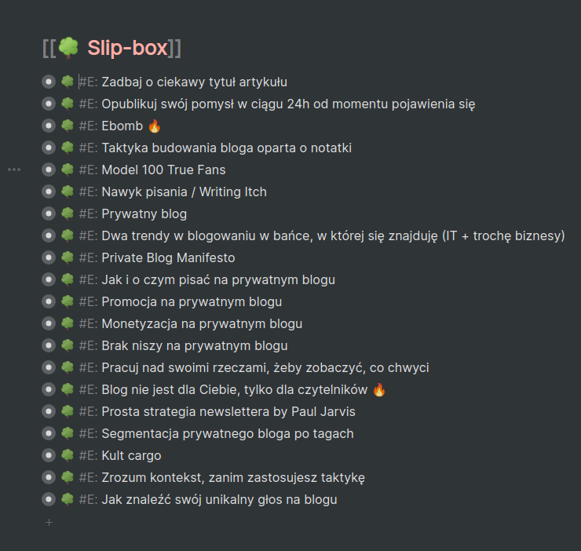
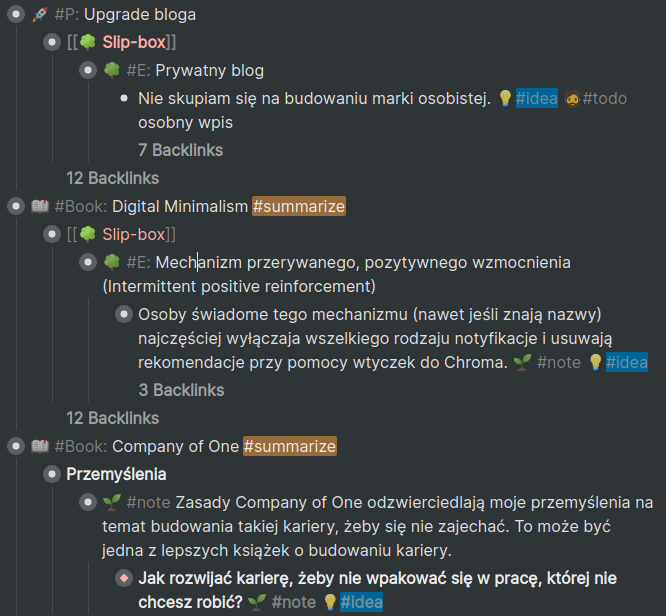
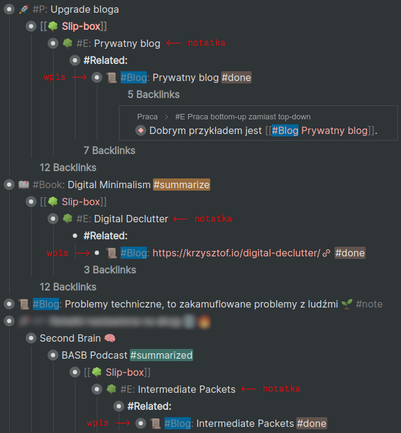

Wiele razy robiłem sobie listy pomysłów na artykuły i na materiały na social media, newsletter itp.

Po latach takiej zabawy skończyło się na tym, że mam pewnie ponad 500 pomysłów na różne treści, ale tylko ułamek z tego wszystkiego jest opublikowany.

Większość z tych pomysłów jest **zapomniana, nieistotna lub zduplikowana** (w podobnej, a czasem nawet tej samej fomie).

Mam też wielką listę potencjalnych projektów, które składają się wyłącznie z tytułów, bo w środku nie ma żadnych materiałów. Większość już dawno się przedawniła.

Dzięki temu kilkuletniemu eksperymentowi potwierdziłem stwierdzenie, że **pomysły są bezwartościowe bez realizacji**. Yay.

## Rozwiązanie

Metodologia [Zettelkasten](https://en.wikipedia.org/wiki/Zettelkasten), a dokładniej książka [How to Take Smart Notes](https://www.goodreads.com/book/show/34507927-how-to-take-smart-notes) pokazała mi, że mogę odwrócić kota ogonem i **zamiast pracować top-down**, czyli od pomysłu do implementacji, **mogę pracować bottom-up**, czyli od implementacji w postaci notatek, do pomysłów, które pojawiają się, gdy te notatki przeglądam, spisuję, grupuję i linkuję.

**Zamiast spisywać kolejne pomysły, zacząłem spisywać, co wiem na dany temat.** Najczęściej przyjmuje to prostą formę podpunktów, które z czasem przekształcam w zwięzły zestaw notatek.

Gdy po jakimś czasie spoglądam na te notatki, to okazuje się, że mam już wystarczająco dużo materiału, żeby przekształcić go w coś publikowalnego - wpis na social media, artykuł, lub coś większego.

Opublikowanie takiego zestawu notatek nie wymaga dużo pracy, bo często zajmuje ~30 minut, a jednocześnie jest dość dobrze przemyślane. Stram się nie dokładać swoich trzech groszy do szumu informacyjnego, więc bardzo mi to odpowiada.

Dobrym przykładem takiego trybu działania jest [wpis na temat prywatnego bloga](/prywatny-blog/).

Powstawał przez dluższy czas na bazie zestawu notatek z mojego researchu na temat tego typu blogów:

Tworząc taki zestaw notatek, **działam w myśl idei "przestań tyle myśleć, zacznij działać"**, a jednocześnie mam czas, żeby przemyśleć, czy to, co myślę, ma sens.

Nie zaczynam od planowania, które często jest tak naprawdę zwykłym odwlekaniem, tylko od akcji.

Zauważyłem, że robienie planów przed podjęciem akcji powoduje, że nie podejmuję akcji, bo plan ciągle pokazuje mi nowe luki, których nie przemyślałem i mi się odechciewa.

Znacznie lepiej mi idzie, gdy **zaczynam coś robić, nabieram rozpędu i dopiero wtedy biorę się za planowanie**. Nagromadzona motywacja pomaga mi wypełnić luki, których nie przemyślałem.

To planowaniu, chęci kontroli i pracy top-down zawdzięczam tak wielką listę niedokończonych projektów, które nigdy nie ujrzą światła dziennego i do niczego się nie przydadzą.

Praca w taki sposób nie ogranicza się do tworzenia wyłącznie treści na bloga, czy na newsletter. Pomysły na większe projekty pojawiają się dokładnie w ten sam sposób - od notatki, po jakiś mały pakiet, do czegoś większego i konkretnego.

## Jak zbieram pomysły?

Do tworzenia notatek używam [Workflowy](https://workflowy.com). Pomysłów nie gromadzę w jednym miejscu, bo pojawiają się organiczne w różnych miejscach, więc oznaczam je po prostu tagiem #idea:

Gotowych treści też nie grupuję, a jedynie oznaczam w ten sam sposób pod hashtagiem "blog":

## Dodatkowe zalety

**Produktem ubocznym, a jednocześnie nieodłącznym składnikiem pracy bottom-up jest całkiem spora liczba [mniejszych pakietów](/pakiety/).**

Zbiór notatek przeważnie spokojnie sobie leży i odpoczywa, a przez to mój mózg ma szansę ochłonąć i po czasie lepiej ocenić, czy nadal mają sens.

Przy okazji treści tworzą się praktycznie same, po czasie i bez spiny.

Walczę też z odwlekaniem na wielu poziomach:

- Od razu zaczynam zadanie.
- Obniżam poprzeczkę (bo to przecież prosta notatka).
- Ustawiam środowisko na przyszłość tak, żeby nie dało się przegrać (bo nie zaczynam z "pustą kartką").
- Od razu popycham pomysł do przodu i karmię potrzebę natychmiastowej gratyfikacji.

Jestem bardziej otwarty na nowe pomysły. Sönke Ahrens w [How to Take Smart Notes](https://www.goodreads.com/book/show/34507927-how-to-take-smart-notes) wyjaśnia dlaczego:

> It seems counterintuitive that **we become more open to new ideas the more familiar we are with ideas we have already encountered**, but historians of science will happily confirm this (Rheinberger 1997).
>
>  (...) without intense elaboration on what we already know, we would have trouble seeing its limitations, what is missing or possibly wrong.
>
> Being intimately familiar with something enables us to be playful with it, to modify it, to spot new and different ideas without running the risk of merely repeating old ideas believing they are new.
