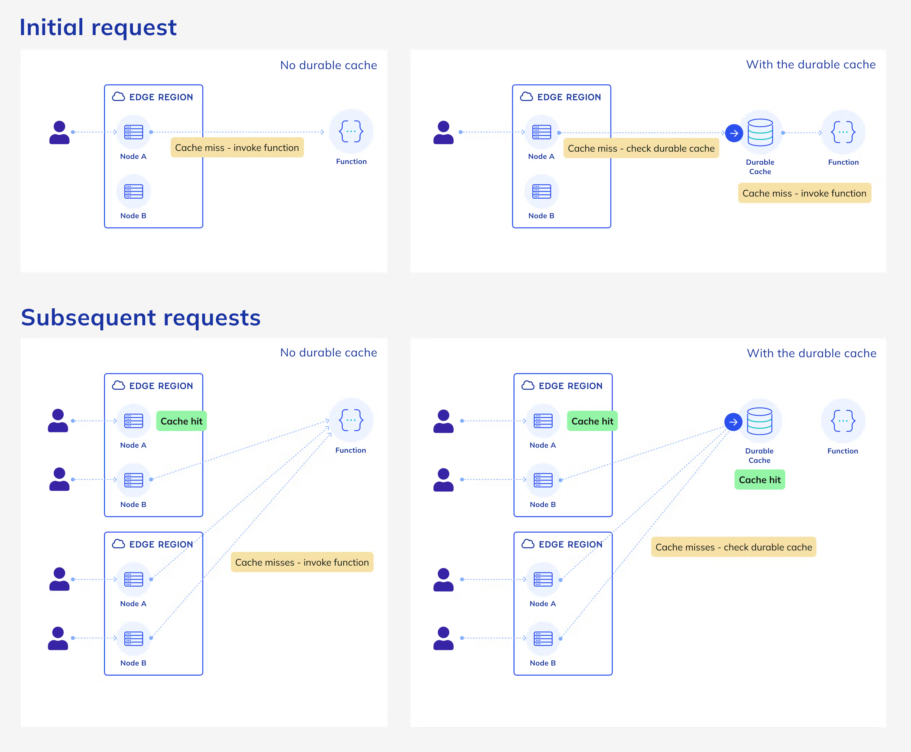

Miałem ostatnio dość spory problem na stronie, gdzie hostuję mój [program szkoleniowy](/spwz/).

Jeden z uczestników wysłał mi maila, że widzi w stopce nie swój email po zalogowaniu.

Po wejściu na stronę miałem to samo - byłem zalogowany na konto innego użytkownika.

Miły poranek stał się w tym momencie dniem gaszenia pożarów.

Na stronie korzystam z `next-auth` w wersji 5 (czyli [Auth.js](https://authjs.dev/)) i bezstanowej strategii JWT, żeby ograniczyć ilość zapytań do bazy.

Oznacza to, że serwer z jakiegoś powodu, wysłał w odpowiedzi header `set-cookie` z tokenem innego użytkownika.

Pierwszą rzeczą, którą zrobiłem, żeby ugasić pożar, było usunięcie maila z responsów serwera, żeby emaile użytkowników nie pokazywały się innym.

Następnie zmieniłem `secret`, którym podpisywane są tokeny JWT, żeby wymusić na wszystkich ponowne logowanie.

Powrzucałem też trochę console.logów, żeby dowiedzieć się, co siedzi w requestach, ale nie znalazłem tam nic ciekawego.

Początkowo myślałem, że problem jest jakoś związany z deployem, bo `next-auth` i Netlify niebardzo się lubią, ale nie miałem żadnego sposobu, żeby to zdebugować.

Jednak jakiś czas temu zmieniłem sposób, w jaki ściągane są dane z serwera.

Wcześniej korzystałem z `getServerSideProps`, ale zmieniłem na klasycznego fetcha i `react-query`, żeby łatwiej kontrolować cache i nie robić niepotrzebnych zapytań do serwera.

Dane na stronie muszą być sciągnięte tylko raz na początku dla każdego użytkownika. Potem, gdy ktoś oznaczy jakiś materiał jako ukończony, to wystarczy, że ręcznie zupdatuję server cache w `react-query` i nie muszę sciągać danych jeszcze raz.

Wygląda na to, że właśnie ta zmiana striggerowała cały problem.

Gdy korzystałem `getServerSideProps`, to nie było problemu, bo tam domyślnie response nie jest cachowany (z tego, co wiem). Jednak w momencie zmiany na fetcha, wszedłem w świat cachowania, cache headerów i tego, jak to wszystko działa w serverlessowym środowisku.

**Najprościej jak można:**

Hostowanie aplikacji Next.js na Netlify jest możliwe dzięki [adapterowi/wtyczce](https://docs.netlify.com/frameworks/next-js/overview/), która cały backend zamyka w netlify functions.

Netlify wprowadziło jakiś czas temu agresywny ["durable cache"](https://docs.netlify.com/platform/caching/#durable-directive), który ma zmniejszyć liczbę wywołań funkcji (koszty, performance, rozwiązywanie problemów, które samemu się stworzyło itd.).

Raz wrzucony do tego cache'a response, może być potem zwracany różnym użytkownikom.

Ten cache teoretycznie respektuje header `Cache-Control` i jeśli jest on ustawiony na `no-store`, to responsy nie powinny być cachowane.

Teoretycznie responsy z headerem `set-cookie` również nie powinny być cachowane, a przynajmniej tak mi się wydaje.

Teoretycznie:

> (..>) responses coming from Netlify Functions, Edge Functions, and proxies are not cached by default.

https://docs.netlify.com/platform/caching/#default-caching-behavior

Jednak dokumentacja wspomina też, że ten cache jest domyślnie włączony dla aplikacji nextowych:

> On Netlify, cacheable responses on sites using the Next Runtime 5.5.0 or later automatically use the durable cache

https://docs.netlify.com/platform/caching/#framework-support

Ciężko więc powiedzieć, jaka jest prawda.

**Sam `next-auth` w swoich endpointach nie ustawia headera `Cache-Control: 'no-store'`**, który zapobiegałby cachowaniu tak istotnych informacji, jak token użytkownika, bo jak pisze sam twórca:

> I concluded that this is not our responsibility.

https://github.com/nextauthjs/next-auth/issues/2408#issuecomment-1491236987

Nie wiem, czy to jest jakiś *standard practice*, ale ja bym go pewnie ustawił, gdybym był autorem tego kodu.

`next-auth` ustawia jednak automatycznie `set-cookie` przy każdym responsie z serwera, żeby odświeżyć token JWT przy każdym zapytaniu do api.

Ja również nie ustawiałem headera `Cache-Control` w moich endpointach, bo nie sądziłem, że jest to potrzebne. Teoretycznie nic nie powinno być cachowane, zwłaszcza że każdy response miał ustawiony header `set-cookie`.

Jednak problem, który mieliśmy, wygląda dokładnie na problem z cachowaniem responsów. Nawet grafika, która opisuje, jak działa Netlify Durable Cache, wygląda DOKŁADNIE jak diagram problemu, na który się natknęliśmy. Prawy dolny róg:



Żeby tego było mało, to jeszcze sam Next.js również cachuje responsy, ponieważ używa swojej własnej implementacji fetcha:

> Next.js has a built-in Data Cache that **persists** the result of data fetches across incoming **server requests** and **deployments**. This is possible because Next.js extends the native `fetch` API to allow each request on the server to set its own persistent caching semantics.

https://nextjs.org/docs/app/building-your-application/caching#data-cache

**Podsumowując:**

Wyglada na to, że brak headera `Cache-Control: 'no-store'` w odpowiedziach z api spowodowała, że w pewnym momencie użytkownicy uderzali, do któregoś cache'a.

Szczerze mówiąc, nie wiem którego, ale obstawiałbym, że tego od Netlify.

W każdym responsie znajduje się header `set-cookie` z tokenem, więc mogli dostać nie swój token, jeśli response został zwrócony z cache'a.

Jak się trochę pogoogla, to widać, że nie tylko ja miałem ten problem i zdarza się to częściej w CDNach:

- https://medium.com/microsoftazure/correctly-configuring-nextauth-js-and-next-js-to-work-behind-azure-frontdoor-cdn-fe09cfa5ec25
- https://github.com/vercel/next.js/discussions/14136
- https://github.com/nextauthjs/next-auth/issues/2408

W przeciwieństwie do wspomnianego w linkach wyżej CDN od Azure, nic w dokumentacji Netlify nie wskazuje na to, żeby responsy miały być cachowane w moim setupie.

Nawet jeśli nie ustawiałem nigdzie headera `Cache-Control: 'no-store'`.

Fakty wskazują jednak na coś innego.

Wszystkie responsy z serwera zawierają header świadczący, że są wrzucane do cache'a:

`cache-status: "Netlify Durable"; fwd=stale; ttl=31483432; stored`.

I pewnie dlatego, w pewnym momencie dostaliśmy nie swoje tokeny JWT w odpowiedzi.

**Rozwiązanie?**

Najlepszym rozwiązaniem byłaby ucieczka z chaotycznego, nieprzewidywalnego świata serverless, który magicznym, nieustandaryzowanym cachem rozwiązuje problemy, które sam stworzył.

Następnie pozbycie się kombinacji Netlify + Next.js, bo jaka jeszcze magia dzieje się w tym ich adapterze.

Samo to, że durable cache jest włączony dla endpointów nextowych, świadczy o tym, że powrzucali tam jakieś niekoniecznie korzystne defaulty i nie jestem w stanie powiedzieć jakie, bez zajrzenia bezpośrednio w kod na GitHubie.

**Obecnie jednak zrobiłem dwie proste rzeczy:**

Dodałem `res.setHeader('Cache-Control', 'no-store')` w endpoincie do pobierania danych oraz

```javascript
const nextConfig = {
  // ...
  async headers() {
    return [
      {
        source: '/api/auth/:path*',
        headers: [
          {
            key: 'Cache-Control',
            value: 'no-store, max-age=0',
          },
        ],
      },
    ];
   },
}
```

w pliku `next.config.js`.

Liczę, że każdy możliwy cache, na który mogą się natknąć responsy z serwera, będzie respektował ten header i problem się rozwiąże. Jeśli nie, to będę szukał dalej i najprawdopodobniej ustawię customowe dla Netlify headery z cachem.

Nadal widzę  `cache-status: "Netlify Durable"; fwd=stale; ttl=31483432; stored` w headerach, więc ciężko stwierdzić, czy ten cache respektuje `Cache-Control`, czy nie.

Powinno działać, ale obecne nie mam już żadnego zaufania do Netlify, bo to nie jedyny przypadek, kiedy coś związanego z hostowaniem tam Next.js nie działa tak, jak powinno.

Mam już też zerowe zaufanie do wszystkiego, co ma `next` w nazwie lub w jakikolwiek sposób jest powiązane z Vercelem.

Na papierze wszystko wygląda doskonale, ale po dłuższym obcowaniu zawsze wychodzą grube problemy, czy to z performancem, czy z "to nie nasza odpowiedzialność".

Przez ostatnie kilka lat nazbierało mi się sporo problemów z tym ekosystemem, ale liczyłem, że w aplikacji, która ma niecałe 500 linii kodu, nie będzie problemów.

🤷‍♂️

Obecnie uczę się jak poprawnie postawić swój serwer na Digital Ocean i zamierzam zmigrować tam wszystko, co obecnie hostuję na Netlify.

Marzy mi się uprościć cały setup do ustandaryzowanych, sprawdzonych, niemagicznych rozwiązań, żebym mógł tworzyć treści, a nie doktoryzować się z tego, jak działa kolejny genialny wymysł twórców platform i frameworków.

Chciałbym też pozbyć się Nexta, ale jeszcze nie wiem, czy poza kombinacją React + Express jest jakaś niehipsterska, sensowna alternatywa, która nie wygląda jak zabawka. Rozkmina na kiedy indziej.

Mam nadzieję, że ten wpis uczuli część osób na podobne problemy.

👉 Jeśli wiesz, co jest przyczyną tego problemu, to daj mi znać. Chciałbym wiedzieć na 100%.

Wielkie dzięki dla Marka, który mocniej popchnął mnie w stronę szukania problemów z cachem.

--

p.s.:

Najlepsze w tym całym zamieszaniu jest to, że uczestnicy szkolenia, którzy napotkali te problemy, byli bardzo wyrozumiali i przyszli z pomocą, zamiast krzyczeć i obwiniać.
Cieszę się, że mogę współpracować z takimi ludźmi.

To też pokazuje, jak bardzo ważne jest uważne dobieranie swoich odbiorców.

