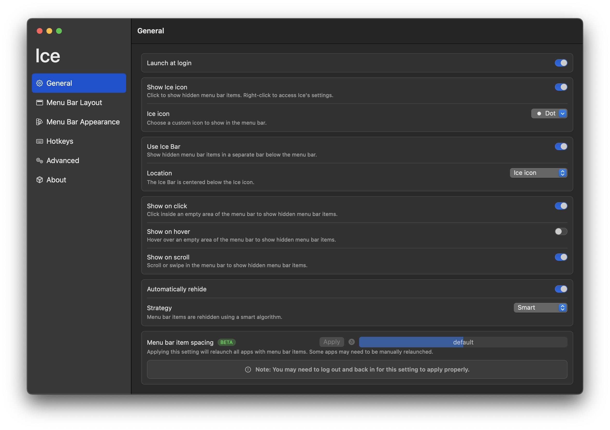
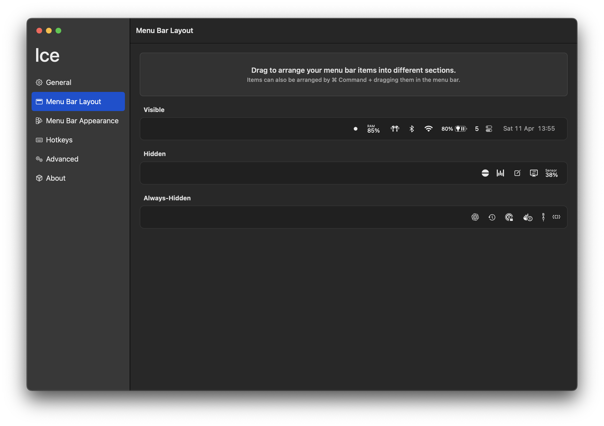

**Stan:** `Szkic`. To jest zalążek większego wpisu o moim setupie macOS. Będę go rozbudowywał iteracyjnie.

## Manager okien

[👷‍♂️ Work in progress](https://github.com/kjendrzyca/dotfiles-mac).

## Pasek menu

Gdy używam MacBooka na wbudowanym ekranie z notchem, a nie na zewnętrznym monitorze, to przy większej liczbie ikonek część z nich po prostu znika za notchem.

macOS nie daje niestety sensownego ([żadnego?](https://discussions.apple.com/thread/255568709?sortBy=rank)) wbudowanego narzędzia do zarządzania tym miejscem (ciekawi mnie, jakie oficjalne rozwiązanie sugerują inżynieży Apple'a).

Istnieją rozwiązania 3rd-party i sprawdziłem dwa:

- [Bartender](https://www.macbartender.com/) -> najpopularniejsze, ale płatne. Licencja dająca lifetime update'y kosztuje ponad 200 zł (kwiecień 2026).
- [Ice](https://github.com/jordanbaird/Ice) -> alternatywa open source, która robi 80% roboty za free.

Korzystam z Ice, bo adresuje wszystkie potrzeby i robi to nawet lepiej.

Wersja dla macOS Tahoe: [release `0.11.13-dev.2`](https://github.com/jordanbaird/Ice/releases/tag/0.11.13-dev.2).

Setup jest prosty:

- włączyłem `Use Ice Bar`, żeby ukryte ikonki wysuwały się w osobnym pasku pod menu barem,
- mniej ważne rzeczy przeniosłem do sekcji `Hidden` i `Always-Hidden` (Ice, w przeciwieństwie do płatnego Bartendera, pozwala na wyświetlenie sekcji `Always-Hidden` - wystarczy kliknąć ikonkę z wciśniętym `Option`),
- zostawiłem pokazywanie ukrytych ikonek po kliknięciu i scrollu,
- włączyłem automatyczne chowanie.

Efekt końcowy:

`General`:

`Menu Bar Layout`:

