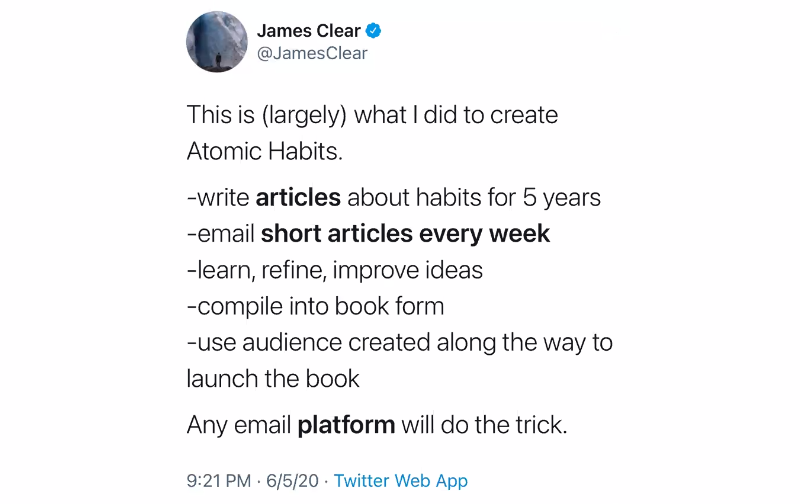
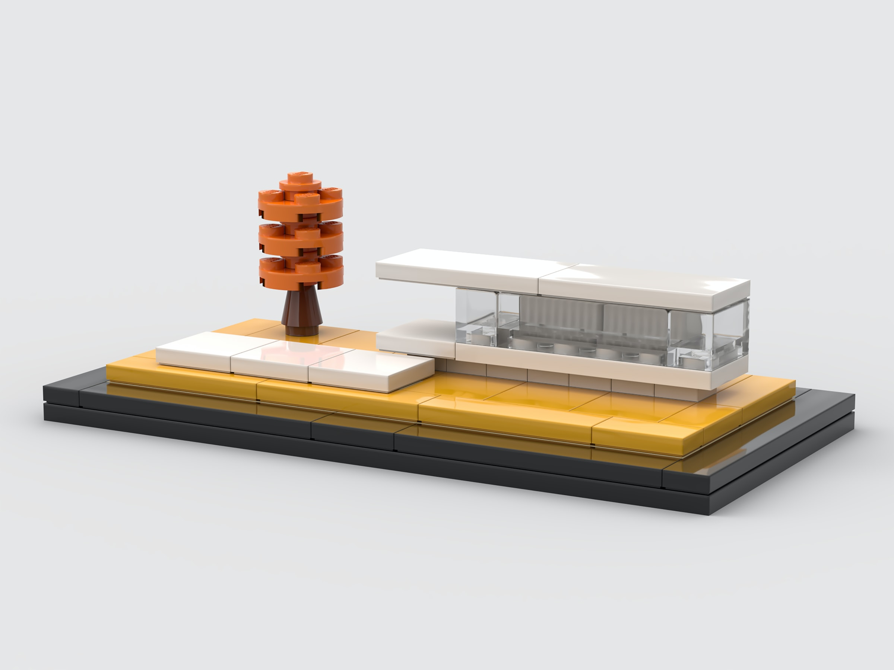

Nie wiem jak Ciebie, ale mnie przytłaczają duże projekty. Jest to ponoć dość częsta przypadłość w pracy umysłowej i kreatywnej.

Największym wyzwaniem jest dla mnie hackowanie motywacji w taki sposób, żeby działała na moją korzyść, a nie przeciwko mnie.

Najprostszym rozwiązaniem, które znalazłem, jest dostarczanie sobie regularnej serii zwycięstw, które mogę świętować.

Podczas pisania kodu sposobem na osiągnięcie regularnej serii zwycięstw jest dla mnie Sausage Making.

Robienie kiełbaski polega na częstym commitowaniu i publikowaniu mniejszych (ale kompletnych) partii kodu. Jest to okazja do świętowania, bo udało mi się coś dowieźć, i do zebrania feedbacku od innych członków zespołu.

## Pakiety

Ten sposób pracy, w bardziej ogólnym znaczeniu, elegancko sformalizował [Tiago Forte](https://fortelabs.co/), który nazywa takie mniejsze kawałki dowiezionej pracy Intermediate Packets, a ja od tego czasu nazywam je po prostu pakietami.

**Pakiet, to jedna mała część projektu lub zadania w postaci:**

- notatki lub zbioru notatek
- zbioru przykładów
- outline'u
- prototypu
- szkicu lub finalnej wersji (np. artykułu)

**Każdy pakiet dostarcza konkretne wyniki pracy i pozwala budować wielkie projekty w małych inkrementach.**

Nawet największe i najbardziej ambitne cele możemy podzielić w taki sposób.

Ogólna zasada podziału na pakiety brzmi tak: **dziel wszystko tak długo, aż poczujesz, że nic Cię nie przeraża i że porażka nie jest możliwa**.

Trudno ponieść porażkę tworząc notatkę, tweet, lub outline.

Zaletą pakietów jest to, że możemy je układać, grupować i dowozić w dowolny sposób - jak klocki Lego.

Praca zmienia się w próbę dowiezienia jednego pakietu na raz.

Wcześniej myślałem o pracy w kontekście zadań, aktywności i bloków czasu. Jak większość osób.

Teraz myślę tak: "zrobię 2 szczegółowe notatki i opublikuje na Twitterze" zamiast "będę pracował nad x przez 1h".

Każdy pakiet pozwala szybciej dostarczyć coś wartościowego, zobrazować wyniki i jest fundamentem lub budulcem dla kolejnych pakietów.

Gdy stawiam sobie za cel dowiezienie jednego lub więcej pakietu każdego dnia, to zwiększam szanse na to, że pod koniec dnia będę z siebie zadowolony. I przeważnie jestem.

Dowiezienie i podzielenie się czymś namacalnym, nawet jeśli jest to jeden mały fragment większego projektu, jest znacznie bardziej satysfakcjonujące niż poświęcenie całego dnia na rozmyślanie, układanie i próbę dowiezienia wielkich planów, których nikt teraz nie zobaczy i które kiedyś w przyszłości, być może złożą się na coś większego.

## Korzyści

👉 Coś, co już wspomniałem: **duże projekty stają się mniej przerażające.**

Duże projekty przerażają, ponieważ boimy się, że zmarnujemy olbrzymie ilości czasu w momencie, kiedy projekt nie zakończy się sukcesem.

Jeśli naszym celem jest dowiezienie jednego pakietu i podzielenie się nim, to łatwiej jest nam zacząć. A gdy projekt nie wypali, to mamy gotowy pakiet, który możemy wykorzystać w innym projekcie.

**👉 Dowiezienie innych projektów staje się łatwiejsze, bo mogę wykorzystać stworzone wcześniej pakiety.**

Bogata baza wiedzy, którą tworzę przy okazji, pozwala wykorzystać w nowych kontekstach to, co dowiozłem w przeszłości.

Niektóre projekty sprowadzają się wręcz do poukładania pakietów w konkretnej kolejności. Jak klocki Lego.

**👉 Jest to forma pracy na głos.**

Mniejszymi pakietami mogę się szybciej podzielić, szybciej zebrać feedback i szybciej na niego zareagować.

Jakiś czas temu dowiedziałem się, że jest to dość istotne, bo lepszy feedback dostajemy na początku pracy.

Ludzie obawiają się krytykować coś, w co włożyliśmy już dużo pracy albo czepiają się wtedy detali, które nie mają znaczenia. Dlatego im szybciej podzielimy się wynikami pracy, nawet w formie draftu, tym lepszy dostaniemy feedback i tym chętniej będą nam go udzielać.

**👉 Jest to genialny sposób na weryfikację pomysłu.**

Zamiast pisać pełny wpis na blogu, mogę zacząć od podzielenia się notatką na Twitterze lub Instagramie.

Zamiast tworzyć pełny kurs, mogę napisać dłuższy artykuł i zweryfikować zainteresowanie.

Mogę stworzyć cotygodniowy mailing, zobaczyć ile ludzi się zapisuje, ile odpisuje.

Każda reakcja na taki kawałek treści daje mi jakiś feedback. Widzę, czy pomysł chwycił oraz, czy jest sens inwestować w niego więcej czasu i energii.

**👉 Mogę dowieźć coś wartościowego niezależnie od tego, ile mam czasu i energii.**

Praca przy pomocy pakietów staje się grą w dopasowanie pakietu do aktualnie dostępnego bloku czasu, poziomu energii, nastroju itd.

Przykład: mogę coś zrobić, czekając w kolejce do lekarza albo w przerwie między spotkaniami.

Gdy mam gorszy dzień i nie chce mi się pisać artykułu, to nie muszę się zmuszać. Przełączam się na robienie notatek lub układanie outline'u, bo i tak je później wykorzystam.

Czasem dowiezienie takiego małego pakietu daje mi kopa w dupę, dzięki któremu i tak ten artykuł napiszę jeszcze tego samego dnia.

**👉 Mniej się przejmuję, czy ktoś mi przerwie. Mam system checkpointów.**

Gdy ktoś czegoś ode mnie chce, to mogę wpleść tę aktywność miedzy to, co robię obecnie.

Pakiety z reguły są dość małe, więc szybciej mogę je dokończyć i zająć się czym innym.

Przy okazji nie muszę ładować całego projektu do głowy, gdy zaczynam nad nim pracę, więc nawet jeśli ktoś mi przerywa, to łatwiej wrócić do ostatniego zadania. Trudno jest się pogubić w takim systemie.

## Flow

Wcześniej o tym nie myślałem, ale [artykuł od Tiago](https://fortelabs.co/blog/just-in-time-pm-4-intermediate-packets/) uświadomił mi, że ułatwiają one wejście w stan flow.

Jest to najprawdopodobniej jeden z powodów, dla których tak dobrze mi się pracuje, stosując to podejście.

Ilość triggerów stanu flow oraz ich opis różnią się w zależności od materiałów, dlatego poniżej wrzucam 6 standardowych oraz opis, w jaki sposób praca przy pomocy pakietów je aktywuje.

**Trigger 1 - Zrozumiałe cele**: łatwiej zdefiniować cele krótkoterminowe i rzadziej się zmieniają. Przez to motywacja jest większa.

**Trigger 2 - Natychmiastowy feedback**: małe pakiety szybciej dowieźć, a przez to szybciej dostać feedback.

**Trigger 3 - Poczucie, że zadanie jest wyzwaniem na granicy umiejętności**: możemy dobrać wielkość pakietu do naszych umiejętności i dostosować go tak, żeby nie był zbyt trudny i zbyt łatwy. Wielkie projekty są z reguły zbyt trudne. Małe pakiety przydają się wtedy, kiedy chcemy złapać trochę odpoczynku między bardziej wymagającymi zadaniami.

**Trigger 4 - Obecność ryzyka**: przestajemy obawiać się braku czasu, tego, że ktoś nam przerwie lub że zapomnimy, nad czym pracowaliśmy. Zastępujemy to bardziej produktywnym ryzykiem, że będziemy pracować zbyt długo nad czymś, co powinno być małe i zająć mniej czasu. To nam daje kopa do pracy.

**Trigger 5 - Bogate środowisko**: bogata kolekcja materiałów i wcześniej stworzonych pakietów powoduje, że zaczynamy pracować w bardzo bogatym, ciekawym i kreatywnym środowisku opartym o wszystko, na co wcześniej się natknęliśmy. W moim przypadku doskonale to widać, gdy stosuję [Zettelkasten](https://en.wikipedia.org/wiki/Zettelkasten).

**Trigger 6 - Urzeczywistnienie pracy**: wynik naszej pracy przenosimy do zewnętrznego narzędzia i mamy ją przed oczami. Zwalniamy w ten sposób zasoby, a to pozwala nam to być bardziej obecnym w danej chwili i dostrzegać rzeczy, które mogłyby nam umknąć, jeśli trzymalibyśmy je cały czas w głowie. To coś w stylu "thinking on paper".

## Deep Work

Teoria pracy głębokiej mówi o tym, że dowożenie wyników na najwyższym poziomie wymaga pracy w długich, nieprzerwanych sesjach głębokiego skupienia.

Dla mnie idealną opcją jest praca głęboka przez 4 godziny bez przerwy. Dni są piękne, gdy coś takie coś się udaje. Jednak niejednokrotnie znalezienie czterech nieprzerwanych godzin jest po prostu niemożliwe.

Pakiety mają kilka zalet związanych z pracą głęboką:

- Pomagają wejść w tryb pracy głębokiej, bo aktywują flow (choć zmienia się wtedy strategia, których jest kilka).
- Pomagają zostać w pracy głębokiej, bo dowozimy mniejsze pakiety i pozostajemy zmotywowani.
- Doskonale nadają się do robienia czegoś wartościowego podczas okresów pracy płytkiej.

Tiago sugeruje, że nie istnieją żadne dowody na to, że potrzebujemy konkretnej ilości czasu, żeby wejść w stan flow i próba dowiezienia jednego małego pakietu często wystarcza do jego aktywacji.

Udało mi się to wiele razy potwierdzić. Przełączałem się w tryb pracy płytkiej, jakieś przetwarzanie maili itp., a w pewnym momencie moje oko przyciągnęła notatka, którą zacząłem poprawiać, a potem po godzinie okazywało się, że nieświadomie przełączyłem się w pracę głęboką.

## Konkretny przykład

Praca nad tym artykułem, to idealny przykład pracy przy pomocy pakietów.

1. Zacząłem od zrobienia notatek z podcastu [The Building a Second Brain](/basb-podcast/).
1. Potem nie chciałem się tym zajmować, ale stopniowo budowałem bazę przykładów. Dorzucałem kolejne małe notatki i testowałem to podejście.
1. Umieściłem notatki na blogu.
1. Zobaczyłem, że temat budzi zainteresowanie, więc zacząłem więcej o nim mówić na stories, nie nazywając tego wprost pracą przy pomocy pakietów.
1. Potem siadłem do pisania artykułu i tak się złożyło, że przez dwa kolejne dni mój poziom energii był bliski zeru.
1. Na szczęście pakiety można dopasować do poziomu energii.
1. Zacząłem więc od podkreślenia najważniejszych notatek z artykułu o Intermediate Packets.
1. To pozwoliło zhackować motywację - dowiozłem coś małego i miałem ochotę na więcej.
1. Zacząłem więc robić swoje notatki, własnymi słowami. To jest trochę trudniejsze, więc poświęciłem na to dwie sesje pracy, pierwszą zrobiłem od razu.
1. Drugą zacząłem kolejnego dnia.
1. Zmusiłem się, żeby zacząć i szybko wszedłem w stan flow, gdzie zapomniałem, że mi się nie chce. Dokończyłem robić notatki własnymi słowami, przy okazji przejrzałem i zrobiłem notatki z kilku innych artykułów oraz własnych przemyśleń. Dostałem kolejny zastrzyk motywacji, bo widziałem już w głowie, jak będzie wyglądał outline tego artykułu.
1. Zacząłem go tworzyć i skończyłem 15 minut później, bo wszystkie klocki Lego były już gotowe, wystarczyło poukładać je w sensownej kolejności.
1. Wtedy musiałem przerwać pracę i jechać gdzieś samochodem, więc postanowiłem, że napiszę artykuł, gdy wrócę (to jest nadal ten sam dzień, kiedy miałem ultra zjazd energetyczny i dzień poszatkowany wyjazdami samochodem, w różne miejsca), a jeśli nie będzie mi się chciało, to zrobię to szybko następnego dnia z rana, kiedy energia do robienia takich rzeczy jest największa.
1. Gdy wróciłem, to postanowiłem bingować Dark na Netflixie. Artykuł napisałem kolejnego dnia.

Gdy wszystko jest poukładane, to dowiezienie finalnej wersji jest ekstremalnie proste.

Każdy z tych punktów wykonuję bez tytanicznego wysiłku, bo korzystam z mniejszych pakietów, które tworzyłem po drodze.

Dodatkową zaletą, której nie wykorzystałem, jest to, że zamiast pisania artykułu, mógłbym z tym outlinem zrobić cokolwiek:

- Zamienić go w maila w newsletterze (choć to też wymaga pisania).
- Nagrać filmik na YT lub story na Instagramie.
- Poświęcić 5 minut, wrzucić wszytko na slajdy i zrobić z tego prezentację lub webinar.

Ten artykuł sam w sobie jest pakietem. Potrzebuje go, żeby dowieźć na bloga kolejny pakiet o pracy bottom-up.

Wszystko, co robię, jest teraz pakietem, które układam po kolei.

> One brick at a time.
