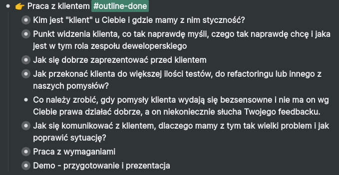
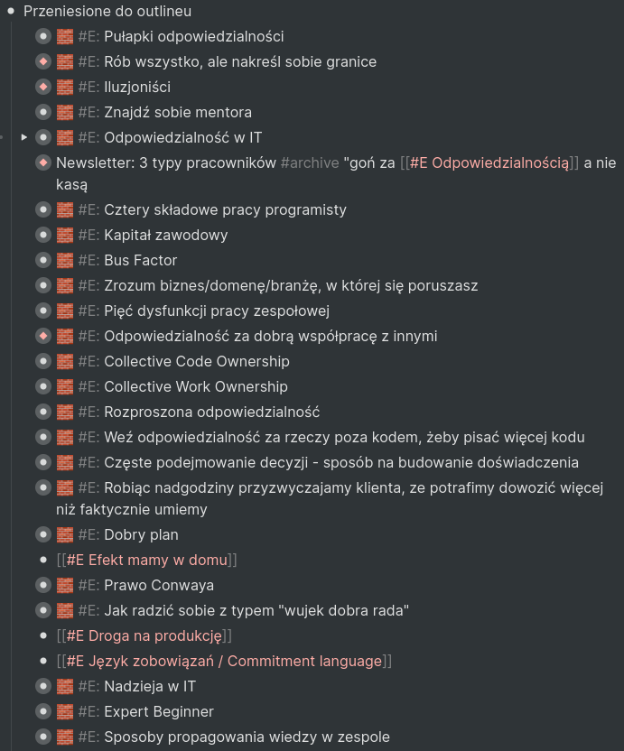

Bloga skutecznyprogramista.pl zacząłem pisać w 2020 i tym zrobiłem to, co zawsze chciałem zrobić.

Od zawsze chciałem prowadzić blog, dzielić się wiedzą oraz budować nowe znajomości.

Każda z tych rzeczy się spełniła. Po drodze nagrałem nawet kilka filmów na YT i odhaczyłem kolejne achievementy.

Po jakimś czasie chciałem przekształcić ten blog w coś więcej niż hobby na boku i stworzyć swój pierwszy program online.
Chciałem w nim pokazać te aspekty pracy w zespole, które uważam za najważniejsze, które dają największy zwrot z inwestycji i które robią z nas kogoś więcej niż klepacza kodu.

To już nie było takie łatwe. Jednak w momencie, w którym to piszę (2022-06-01) mam gotowy outline i agendę programu, który będę jutro sprzedawał.

Szczęściem w nieszczęściu jest to, że po drodze nauczyłem się naprawdę wiele, głównie o tworzeniu treści.
Jednak nigdzie, poza kilkoma newsletterami, nie opisuję swojej drogi w transparenty sposób i chciałbym zmienić to tym wpisem.

👉 Ten wpis to dziennik zdarzeń, gdzie zamierzam udokumentować całą drogę od początku do końca.

Początkowo może być tu mało szczegółów, ale będzie coraz więcej.

(Zainspirował mnie [24 godzinny challenge Amy Hoy](https://stackingthebricks.com/24-hour-product-challenge/)).

## Styczeń 2020

Zacząłem od pisania bloga i newslettera https://skutecznyprogramista.pl/blog/.

Narzędzia, których użyłem to Gatsby i Mailerlite.

Chciałem podzielić się tym, czego nauczyłem się przez lata o pracy w IT i jednocześnie ułożyć sobie wszystko w głowie.

Największą zaletą bloga jest to, że wszystkie rzeczy, które tam opisałem, działają i są sprawdzone wielokrotnie sprawdzone w bojach przez wiele osób.

Największą wadą jest to, że przez długi czas mój sposób pisania był oparty o "musisz", "powinieneś", o próbę bycia zabawnym trochę za mocno i o przekonywanie ludzi do tego, że mam rację.

Wpisy dalej tam istnieją i strasznie źle mi się je czyta, mimo że zawierają wszystko to, co u mnie zadziałało.

## Kwiecień 2020

Opublikowałem [mój pierwszy film na YT](https://youtu.be/frOtId1JU88).

Od dawna wiedziałem, że YT działa bardzo dobrze jako medium do łączenia się z ludźmi, którzy są zainteresowani tematami, o których chcemy mówić.

Wtedy moją największą inspiracją był [Thomas Frank](https://www.youtube.com/c/Thomasfrank) i zawsze chciałem tworzyć filmy na YT w ten sposób, co on.

Nauczyłem się całkiem sporo o tym, w jaki sposób nagrywać, oświetlać i montować filmy. Miałbym z tym bardzo dużo funu gdyby nie to, że tworzenie filmów na YT jest ekstremalnie czasochłonne.

Nagranie 10 minutowego filmu to kilka godzin pracy. Pracy, której nie da się wyedytować i poprawić. Jak ją wrzucę w Internet, taka już zostanie na wieki.

Z tego powodu nagrałem tylko 6 filmów (ostatni miał premierę 2020-06-25) i wróciłem do pisania. Planuję wrócić jeszcze na YT ale w lżejszej formie, gdzie będę dokumentował, co robię i nie będę musiał przejmować się tyle nagrywaniem, montażem i tym, że treści nie można poprawić.

Narzędzia, które wykorzystałem do nagrywania można znaleźć [w sekcji "Sprzęt"](/narzedzia/#Sprzet).

## Październik 2020

Zacząłem zmieniać podejście do pisania postów i wyrzucać wszystkie "musisz"/"powinieneś".

Napisałem o zmianie podejścia w newsletterze: https://preview.mailerlite.com/w0y2e3

To była największa i najlepsza zmiana w tworzeniu treści jaką zrobiłem.

Gdy byłem w trybie "musisz/powinieneś", to musiałem (;)) przekonywać wszystkich, że to, co tam wrzucam, ma sens i że naprawdę muszą/powinni.

Do tego momentu tworzenie treści było bardzo trudne, bo cały czas starałem się coś udowodnić.

Wynikało to oczywiście z chęci niesienia pomocy, bo te rzeczy naprawdę działają, ale jest to tylko jeden ze sposobów na osiągnięcie jakiegoś celu i każdy może mieć inny.

W tym momencie [zacząłem dokumentować](/dokumentuj-zamiast-tworzyc/) i proces ten trwa do teraz.

Wydaje mi się, że tryb "musisz/powinieneś", to obecnie największy rak wśród twórców treści i byłoby nam wszystkim lepiej, gdyby każdy pokazywał, co działa u niego i nie próbował nikogo do niczego przekonywać. Bo kontekst każdego z nas może się różnić.

## Pierwsze miesiące 2021

Miałem treści, które nie pasowały do bloga skutecznyprogramista, a chciałem się nimi podzielić.

Część przemycałem w newsletterze, ale to nie wystarczało. Stworzyłem więc do tego celu blog, który obecnie czytasz. Na początku nie wiedziałem, jak podzielić treści między dwa blogi, ale po jakimś czasie wszystko mi kliknęło. Głównie za sprawą takich ludzie jak [Joel Hooks](https://joelhooks.com/) i [Nat Eliason](https://www.nateliason.com/).

Po jakimś czasie [opisałem podejście do pisania prywatnego bloga](/prywatny-blog/), którego celem jest dokumentowanie rzeczy, które mnie interesują i którymi się zajmuję.

## Sierpień 2021

Ogłosiłem, że praca nad blogiem skutecznyprogramista.pl w takiej formie, jak teraz, przestała mnie interesować i że postanowiłem zamienić go w mailing, który doprowadzi odbiorców do pełengo programu.

Zrozumiałem, że pisanie ragularnego newslettera oraz bloga wyłącznie na tematy IT mnie znudziło i nie przynosi tyle wartości ile bym chciał.

👉 Zrozumiałem, że optymalny tryb tworzenia dla mnie to założenie projektu, stworzenie w jego ramach czegoś konkretnego od początku do końca, przeprowadzenie odbiorcy od punktu A do punktu B, a potem ruszenie z następnym projektem.

Moje rozkminy były mocno połączone ze zmęczeniem branżą IT, wypaleniem (kilka miesięcy zajęło mi zrozumienie, że to było wypalenie) i rzuceniem etatu od 04.2021 do 10.2021.

Więcej na temat tej decyzji opisałem w newsletterze: https://preview.mailerlite.com/f9y5t2

Inspiracją do stworzenia mailingu w tej formie byli blogerzy z zachodu, którzy często tworzą mailowe minikursy wprowadzające do produktu, które w kilka dni lub godzin przynoszą wymierną wartość ludziom oraz mailingi Maćka Aniserowicza.

## Październik 2021

Znowu zacząłem pracować na etacie, choć na trochę innych warunkach niż wcześniej. Pisałem o tym w podsumowaniu [2021](/podsumowanie-2021/).

Powrót do regularnego pisania kodu i dogrywania się z zespołem spowodował, że brakło mi zupełnie energii na cokolwiek innego.

Miałem w tym czasie ostro pracować nad segregowaniem i układaniem materiałów do programu, a zajmowałem się głównie pisaniem kodu w pracy.

Projekt trwał pół roku i przez pierwsze miesiące udało mi się wyrobić nawyk, który pożyczyłem od mojego kolegi [Bartka](https://bartekwitczak.com/) - wstaję wcześnie rano i od razu zabieram się do pracy nad własnymi rzeczami, a dopiero potem, po dowiezieniu [jakiegoś kawałka](/pakiety/), siadam do pracy dla klienta.

Do teraz uważam, że jest to dla mnie najlepszy nawyk, które muszę się trzymać. Nadal mam problem w sytuacjach niestandardowych, czyli np.:
- z jakiegoś powodu muszę rano zająć czymś innym (coś dla klienta, jakieś spotkanie, auto trzeba zawieźć na warsztat)
- zbyt późno poszedłem spać i rano nie wstałem odpowiednio wcześnie
- coś w życiu tak bardzo wyczerpuje mi energię, że nie chce mi się rano pracować nad czymkolwiek (przykład: szukanie kolejnego projektu i rekrutacje)

## Maj 2022

Takim porannym trybem pracy udało mi się jakoś doczołgać do maja 2022 i skończyć układanie materiałów.

W między czasie pisałem kolejne maile, aczkolwiek od grudnia przestały być one regularne i bardzo mnie to boli.

Czemu? Bo regularne maile miały być podstawą do budowania zaufania wśród odbiorców. Bez tego muszę liczyć, że wystarczą punkty splendoru, które nabiłem wcześniej, tworząc bloga, nagrywając YT, stories na Instagramie i wymieniając się doświadczeniami w mailach oraz prywatnych wiadomościach.

Z drugiej strony trwało to też zbyt długo. Idealnie pierwszą wersję kursu powinienem dostarczyć po 1-2 miesiącach od ogłoszenia i dać ludziom pełną wersję, która przyniesie najwięcej wartości, a nie rozdrabniać się w niekończących się mailach. Przynajmniej dla mnie taki tryb ma największy sens, zgodnie z tym, co pisałem wyżej na temat "optymalnego tryb tworzenia".

Podczas układania materiałów wybierałem tylko to, co najważniejsze. Wiele rzeczy, które wrzucałem wcześniej na bloga nie trafią do finalnego programu, bo są tylko jego rozszerzeniem. Często mówiłem o rozwoju w IT, a to nie jest krytyczne do tego, żeby pokazać jak skutecznie pracować w zespole.

W całym procesie wyboru tego, co najważniejsze mocno pomogły mi archiwalne wpisy na blogu Paula Jarvisa o tworzeniu minimalistyczego biznesu, jego książka [Company of One](/company-of-one/) i [książka Just Fucking Ship](/jfs/) od [Amy Hoy](https://stackingthebricks.com), która pokazuje jak szybko dowieźć pierwszą wersję produktu.

W skrócie: **im mniej materiałów, tym lepiej. Im szybciej dowieziesz pierwszą wersję, tym lepiej**.

U mnie nie było to takie proste, bo wiedzę i doświadczenie, które chcę przedstawić, zbierałem przez kilka lat. Choćbym chciał, to ten program nie będzie krótki, bo jest zbyt wiele tematów, które zaliczają się do kategorii "niezbędne". Przez jakiś czas zastanawiałem się czy nie wyodrębnić tylko jednego modułu z całego kursu i dowieźć tylko tyle, ale brakuje wtedy punktów zaczepienia, które pokazują dlaczego akurat to, o czym mówię, ma sens. Dlatego będzie całość albo nic.

Życie ułatwiają mi też doświadczenia z tworzenia prezentacji i szkoleń stacjonarnych.

Gdy tworzę szkolenie lub prezentację, to zawsze zaczynam od dwóch rzeczy:
- Spisania transformacji, którą ma przejść odbiorca (Punkt A -> Punkt B).
- Stworzenia szczegółowego outline'u, w którym w wielokrotnie zagnieżdżonej liście spisuję wszystkie tematy, które chcę poruszyć i układam je w sensowny flow tak, żeby jeden temat przechodził płynnie w kolejny.

Taki outline powoduje, że po wrzuceniu go na slajdy, mogę praktycznie o każdym temacie opowiadać na freestyle'u. Jakość takiej prezentacji zależy wtedy wyłącznie od tego jak dobrze mam przemyślany każdy temat.

Dokładnie to samo wykorzystałem tutaj i w każdym innym kawałku treści, który tworzę.

Konkretne treści zbieram w moim [systemie do notatek](/second-brain/). Pozwala mi to stworzyć outline, a potem uzupełniać treścią:

