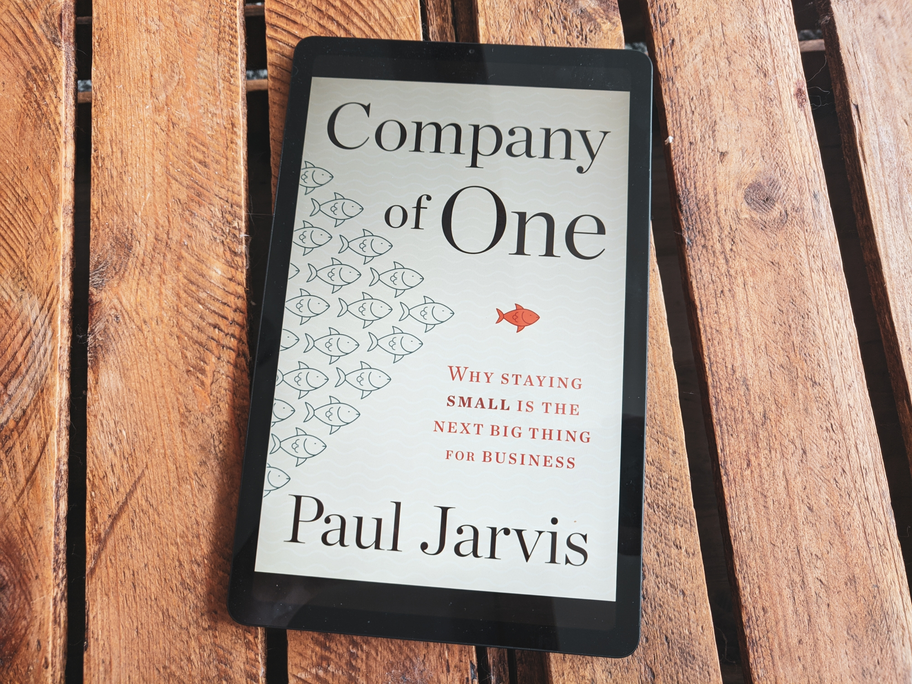
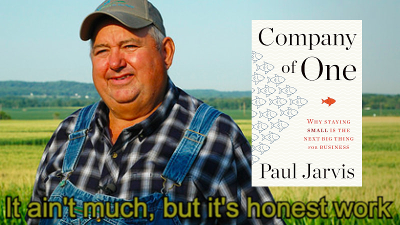

Company of One to książka, która pokazuje jak budować biznes online, korzystając z tych samych zasad, co mały, lokalny, "kraftowy" i dochodowy biznes, którego właściciel zna wszystkich po imieniu i którego lubią wszyscy jego klienci.

Company of One to ta osiedlowa piekarnia i jej właściciel, którego wszyscy znają od lat. Wszyscy wiedzą, że walczył z ciężką chorobą dwa lata temu, że jego żona chodzi na co tydzień na mszę w niedzielę, że jeździ starym VW, bo nie ufa nowym samochodom i naprawia go mniej więcej raz na miesiąc, że 10 lat temu pokłócił się z synem i od tamtego czasu ze sobą nie rozmawiają, że większość sezonu letniego spędza na działce i zawsze pozwala dzieciakom zrywać czereśnie ze swojego drzewa, ale jeśli podeptasz mu sadzonki, to zapamięta Ci to do końca życia.

Część osób nie toleruje tego, jaki jest i kupują pieczywo w supermarketach lub innych piekarniach, ale on się tym nie przejmuje, bo przez te wszystkie lata pracował nad jakością swoich wyrobów i zadowoleniem obecnych klientów, a nie nad wzrostem i pozyskiwaniem nowych. Dzięki temu zdobył wierne grono stałych klientów, którzy zawsze u niego kupują, a co roku, stopniowo przybywa nowych.

Nauczył się, że to, co ma, jest dla niego wystarczające i pozwala mu na bezstresowe, dostatnie życie. Zbudował działalność wokół swojego życia, a nie na odwrót. Dlatego odrzuca wszelkie propozycje wcielenia swojej działalności do ogólnokrajowej sieci piekarni. Wie, że straciłby wtedy kontrolę i nie wiadomo, czy nie narobiłoby mu to więcej pracy niż ma teraz. Możliwe, że ucierpiałaby wtedy jakość, bo musiałby się skupić na tym, żeby produkować więcej.

Tego rodzaju małe biznesy, to ucieleśnienie Company of One.

Zaskoczyło mnie, że zasady opisywane w Company of One bardzo dobrze aplikują się nie tylko do budowania małego biznesu, ale też swojego sposobu pracy, jako pracownik w firmie. Sposobu, dzięki któremu się nie zajedziesz i będziesz pracować w zgodzie ze sobą. Jest tu dużo wspólnych kropek z ["So Good They Can't Ignore You"](https://www.goodreads.com/book/show/13525945-so-good-they-can-t-ignore-you) Cala Newporta i żałuję, że nie przeczytałem tych dwóch książek dawno temu jedna po drugiej.

**Moja ocena: 9/10**

## Wstęp

Company of One to mindset, który kwestionuje ciągły wzrost dla samego wzrostu i składa się z trzech elementów:

1. Zacznij od najmniejszej rzeczy.
1. Zdefiniuj "wzrost".
1. Ucz się cały czas oraz iteruj.

Można go zastosować do budowania małych firm, działalności jednoosobowej, a także kariery wewnątrz firmy lub korpo. Część dużych firm też stosuje elementy Company of One.

> "The word “intrapreneur” points to one example of a company of one within a larger organization. It describes corporate leaders who come up with their own goals and then execute them. They don’t need much direction, micromanaging, or oversight, as they’ve been given full work autonomy. They know what needs doing and they just do it. They’re aware of the needs of the company and how their talents fit, and they just get to work."

## Główne założenia Company of One aka TL;DR

- **Nr 1: Skup się na tym, żeby biznes był lepszy, a nie większy.**
- Określ, co dla Ciebie znaczy "wystarczająco dużo".
- Zamiast skupiać się na wzroście, skup się na efektywności.
  - Zwiększ efektywność pracowników, zamiast zatrudniać nowych.
  - Mniej wydawaj.
  - Pracuj wydajnie nad projektem, zamiast poświęcać więcej godzin.
- Nie wymieniaj czasu za pieniądze, korzystaj z systemów, automatyzacji, oraz twórz powtarzalne procesy.
  - Przykład: produkty, soft, kursy online, delegowanie pracy.
  - Zabiera to czas, ale w takim modelu możesz mieć teoretycznie nieskończoną liczbę klientów, a zysk oderwany jest od poświęconego czasu (przynajmniej częściowo).
  - Freelancing to pierwszy krok do zbudowania Company of One, ale freelancerzy nadal wymieniają czas za pieniądze.
- Kwestionuj wzrost, rozwązuj problemy przy użyciu tych zasobów, które masz już dostępne.
  - "Więcej" to najłatwiejszy sposób rozwiązywania problemów, ale nie najmądrzejszy.
  - Wzrost zawsze niesie ze sobą koszty: większy narzut pracy, złożoność, odpowiedzialność, wydatki, wypłaty dla pracowników itd.
  - Limit założony na wzrost powoduje, że mamy szansę dojść do mądrzejszych i bardziej kreatywnych rozwiązań.
  - Tylko w ostateczności zezwalaj na wzrost.
- Buduj działaność wokół swojego życia, a nie w drugą stronę.
- Maksymalizuj swoją pracę w taki sposób, który działa dla Ciebie, zamiast skupiać się na nieskończonym wzroście.
  - Pracuj swoim tempem.

## 4 cechy pracy w modelu "Company of One"

### Elastyczność

Elastyczność wpływa bezpośrednio na to, czy uda Ci się z powodzeniem prowadzić firmę. Jest to ważniejsze niż edukacja, wykształcenie, czy nawet doświadczenie.

Akceptuj rzeczywistość taka jaką jest. Skup się na tym jak jest, a nie jak "powinno być".

Kieruj się poczuciem celu, a nie tylko pieniędzmi. Dzięki temu łatwiej będzie Ci przetrwać, gdy coś się przestanie udawać.

Poczucie celu bierze się z określenia i stosowania do swoich własnych wartości.

Naucz adaptować się szybko do zmian, takich jak zmieniający się rynek, czy zwolnienie z pracy.

Bądź ["Antifragile"](https://www.goodreads.com/book/show/13530973-antifragile).

Skup się na kreatywnych elementach pracy, bo to, co może zostać zautomatyzowane, w końcu zostanie zautomatyzowane.

(O tym samym mówil Naval Ravikant m.in. w ["The Almanack of Naval Ravikant"](https://www.goodreads.com/book/show/54898389-the-almanack-of-naval-ravikant)).

### Autonomia

Company of One pozwala w większym stopniu kontrolować swoje życie i pracę, ale żeby skorzystać z tej cechy, musisz spełnić kilka wymagań.

**Wymasteruj swoją główną umiejętność.**

Autonomia bez kompetencji to recepta na porażkę.

Kompetencje i autonomia się ściśle powiązane.

Skup się na tym, żeby być najlepszym w tym, co robisz, żeby wykorzystać płynące z tego korzyści, takie jak autonomia. Pisał o tym Cal Newport w "So good they can't ignore you".

Droga do zdobycia odpowiednich umiejętności:
- Praca w miejscu (lub w taki sposób), w którym masz mniejszą kontrolę, autonomię i elastyczność, ale w zamian chłoniesz nowe umiejętności jak gąbka.
- Uczysz się szybko zasad pracy w branży, żeby potem je łamać w imię kreatywności.
- W przypadku pracy dla siebie, wiąże się tym, że będziesz początkowo mniej wybredny w wyborze klientów, z którymi pracujesz. Ale dzięki temu zdobędziesz kompetencje i kontakty, które pozwolą ci w końcu być bardziej wybiórczym.

**Pamiętaj o tym, że autonomia wiąże się z rozwojem wszerz.**

Zrozum sprzedaż, marketing, zarządzanie projektami i utrzymanie klientów.

### Szybkość

Company of one działa najlepiej pod wpływem ograniczeń, bo dzięki nim pojawia się kreatywność i pomysłowość.

Skup sie na tym jak pracować mądrzej, zamiast ciężej.

Usprawniaj systemy, procesy i struktury, żeby być bardziej wydajnym i osiągnąć więcej w tym samym, albo krótszym, czasie.

Pracuj szybciej i wydajniej, żeby oblokować sobie czas na inne rzeczy, które są dla Ciebie ważne.

Pracuj w sposób, który pozwala na szybkie zmiany kursu:
- Np. nie akceptuj zewnętrznego finansowania i ograniczaj pracowników.
- Zamiast tego szybko wypuść pierwszą wersję produktu, który zacznie zarabiać na siebie, a potem iteruj.
- Ograniczaj koszty jak to tylko możliwe, żeby to, co robisz, stało się opłacalne jak najszbyciej.

### Prostota

Twórz proste systemy, procesy, zasady i rozwiązania.

Upraszczaj procesy, usuwaj niezbędne kroki, żeby dowozić zadania szybciej.

W taki sposób definiujesz wzrost w Company of One - nie przez dodawanie, tylko przez usuwanie.

Zbyt wiele produktów, usług, zasad, procesów i warstw zarządzania powoduje zastój.

Zeskaluj swoj pomysł w dół i wprowadź go w życie teraz, po taniości, jak najszybciej.

Jeśli Twój pomysł wymaga od samego początku wielkiej ilości pieniędzy, czasu, albo jakichkolwiek innych zasobów, to najprawdopodobniej zbyt daleko wybiegasz w przyszłość.

Zacznij od jednego płacącego klienta. A potem dokładaj następnych.

## Celem końcowym jest pozostać małą działalnością

### 1. Cały czas myśl o tym jak lepiej pomóc obecnym klientom, zamiast ciągle pozyskiwać nowych

Obecni klienci mogą być wszystkim, czego potrzebujesz.

### 2. Skup się na tym, żeby Twój biznes był lepszy, a nie większy

  Zamiast brać na siebie więcej pracy, żeby zwiększyć zysk, zwiększ ceny.

  Overhead = death

### 3. Nie skaluj swojego biznesu jeśli nie musisz

Ustalenie wzrostu jako głównej strategii biznesowej, to szkodliwa decyzja.

Duże biznesy wcale nie są bardziej odporne na porażkę.

Wśród 3200 badanych tech startupów, 74% upadło z powodu zbyt szybkiego wzrostu.

Skup się na samodzielności, prostocie, niezależności, długoterminowej elastyczności, na tym, żeby Twoja działaność pozostała mała, ale za to tak opłacalna, jak to tylko możliwe, bez konieczności polegania na zewnętrznym finansowaniu.

### 4. Ustal sobie górną granicę, żeby zminimalizować liczbę problemów spowodowanych zbyt szybkim wzrostem

Znajdź punkt, w którym korzyści i radość z budowania firmy jest maksymalna, zgodnie z [prawem malejących przychodów](https://en.wikipedia.org/wiki/Diminishing_returns).

Zamiast działać jak większość firm, które nie ustalają dolnych granic - "wzrost listy mailowej o 2000 użytkowników dzienie" - ustal sobie cel w stylu: "2000 użytkowników dziennie, ale nie więcej niż 2200".

Oprogramowanie człoweka pierwotnego nie nakłada na nas górnych granic, bo w przeszłości miało to sens - ludzie musieli martwić się o zasoby, bo było ich mało. W nowoczesnym świecie, w którym mamy wszystkiego na dużo, nie jest nam to już potrzebne i może być szkodliwe.

### 5. Używaj zazdrości wyłącznie jako wyznacznika tego, co jest dla Ciebie wartościowe i jako inspiracji do tego, co można osiągnąć

Gdy wiesz, co triggeruje Twoją zazdrość (np. duża ilość pieniędzy), to możesz zastanowić się, jak to osiągnąć na własnych zasadach.

Nie porównuj się z innymi i nie próbuj ich kopiować. Z kilku powodów:
- Przyćmisz swój własny głos.
  - W najlepszym wypadku będziesz na drugim miejscu i wejdziesz w obszary wspózawodnictwa i konkurencji. Nie ma sensu być na drugim miejscu, skoro możesz być na pierwszym.
- Odwrócisz swoją uwagę od robienia roboty i swoich klientów.
- Nie wiesz w jaki sposób został utworzony finalny produkt, z którym się porownujesz i jakie poniósł porażki. Nie jesteś w stanie zrobić tego obiektywnie.
  - > "Envy is also based on a false comparison, like comparing uncooked ingredients to a delicious baked pie. Envying others, we see only the end result or the final product—the delicious dessert. But in ourselves, we see all the not-so-tasty starting ingredients and are aware of all the real work required to combine them into a successful end product."
- Nie musisz mieć takiego samego podejścia, jak Ci którym zazdrościsz, skup się na tym, żeby zbudować biznes w zgodzie ze sobą, zaczynając od czegoś małego, ale użytecznego i skup się na tym, żeby to ulepszać, a nie żeby rosnąć.

## Bądź dobrym liderem

Możesz być introwertykiem i stworzyć Company of One. Ekstrawertycy niekoniecznie są najlepszymi liderami.

Działaj wg modelu Servant Leadership:
- Bądź dobrym słuchaczem. Słuchaj, co Twój zespół ma do powiedzenia.
- Pomagaj innym osiągnąć ich cele.
- Zamiast skupiać zainteresowanie na sobie, okaże je innym.

Ukształtuj swoją działalność wokół tego, co robisz najlepiej.

> "What I have done is structure my business around what I’m better at—online teaching and written communication. I’ve turned my introversion into a positive tool, instead of an excuse for inaction. I find ways to lead that suit my personality and skill set: I avoid speaking to large groups and instead lean more on one-to-one communication. My introverted nature is the primary reason I teach online courses instead of doing speaking gigs. Online courses allow me to use a channel through which I can communicate effectively, and in a way that my audience connects with."

### 1. Zachowaj balans między autonomią i udzielaniem wskazówek.

Ustal jasny kierunek i procery, a potem usuń się z drogi.

Zatrudniaj najlepsze osoby, którym dasz autonomię i którymi nie będziesz musiał zarządzać.

Autonomia nie oznacza, że możesz olać zasady i procesy.

Wprowadź procesy alignmentu, żeby ustalić wspólne cele i mindset.

Zadbaj o odpowiednią ilość feedbacku, wsparcia, procesów i struktury, która jednak pozwoli działać wszystkim autonomicznie.

### 2. Bądz generalistą.

Zacznij od specjalizacji, a potem rozwijaj komplementarne umiejętności, które będą Ci potrzebne.

Rozwój wszesz jest ekstremalnie wartościowy, gdy działasz w modelu Company of One.

Co warto wiedzeć:
- Zrozum, w jaki sposób myslą inni ludzie i w jaki sposób podejmują decyzje odnośnie Twoich usług lub produktów, czy też ogólnie tego, co robisz.
- Naucz się efektywnie komunikować (w mowie i piśmie), żeby inni mogli łatwiej Cię zrozumieć. Większość komunikacji w biznesie online jest pisana.
- Pamiętaj, że "knowledge =/= wisdom". Będziesz dużo zgadywał, więc musisz pozostać elastyczny.
- Naucz się mówić nie, pozostań lekki i zwinny w tym, co robisz. Na twojej drodze pojawi się wiele okazji i zadań, które musisz nauczyć się szybko ewaluować, żeby nie odciągnęły Cię od tego, co chcesz osiągnąć (Patrz: [Essentialism](https://www.goodreads.com/book/show/18077875-essentialism)).
- **Naucz się rozbijać decyzje na mniejsze, żeby łątwiej je przetrawić i szybciej wybrać odpowiedni, najrozsądniejszy dla danej sytuacji kierunek.**

Pamiętaj o Paradoksie Władzy.

Kiedy zyskujemy władzę przez dobry leadership, to tracimy te cechy, dzięki którym tę władzę zyskaliśmy - empatię, samoświadomość, trasparentność i wdzięczność.

Bądź transparentny. Szczerze i w takim samym stopniu mów o swoich sukcesach i porażkach. Wyrażaj wdzięczność i empatię względem innych ludzi.

Wyciągaj wnioski ze swoich porażek, zamiast ich ignorować.

### 3. Zachowaj balans między hustlowaniem i odpoczynkiem

Hustling jest ok tak długo, jak nie prowadzi do pracoholizmu i zaniedbań w innych obszarach życia.

Badania wskazują, że hustlerzy nie radzą sobie lepiej niż nonhustlerzy.

> "Workaholism, a term coined in 1971 by psychologist Wayne Oates, is the epitome of hustling. The workaholic’s need for work becomes so excessive that it creates disturbances in their health and relationships. Interestingly, Oates found that hustlers don’t outperform nonhustlers; the only noticeable impact of their hustling is higher job stress, greater work-life conflict, and deteriorating health. His research found no relationship between workaholism and greater financial reward or self-efficacy."

## Jak rozwijać firmę, która nie rośnie?

Wzrost z natury nie jest niczym złym, trzeba go tylko zbalansować w oparciu o sensowne, długoterminowe strategie.

Nie stosuj klasycznych taktyk growth-hackingowych. Są z reguły zbyt natarczywe i (jak sama nazwa wskazuje) nastawione na wzrost, zamiast na budowanie długofalowej relacji z odbiorcą.

Nie stosuj tych taktyk tym bardziej, jeśli w jakiś sposób szkodzą Twojej spójności.

Przykład: pop-up na zapis newslettera działa zajebiście, ale na dłuższą metę może wkurzyć Twoich odbiorców (większość osób nienawidzi tych popupów). W newsletterze ważniejsza jest jakość listy, a nie ilość zapisanych osób. Zamiast tego dostarczaj newsletter z dużą ilością wartościowych treści, które przyciągają takich odbiorców, jakich chcesz przyciągać.

Nie poświęcaj customer experience w imię szybkiego nabywania odbiorców, bo to nie jest dobra długoterminowa strategia.

Pamiętaj, że większość firm rośnie z tych czterech powodów: inflacja, inwestorzy, utrata klientów i ego.

Dzięki temu lepiej przygotujesz się na decyzje, które Cię czekają i unikniesz wzrostu z powodów, które nie mają dla Ciebie sensu.

Będzie Ci łatwiej prowadzić działalność jeśli pozostanie mała, zachowa integralność i będzie odzwierciedlać Twoją osobowość.

### 1. Priorytetyzuj sprzedawanie kolejnych rzeczy obecnym klientom

Skup się na tym, żeby to, co sprzedajesz było opłacalne i zyskowne dla Twoich klientów, a zostaną z Tobą na dłużej i będą przekonywać innych, że warto.

Bo tak naprawdę nie obchodzi ich Twój zysk, tylko ich własny.

Utrzymuj i dbraj o prawdziwe relacje ze swoimi klientami, cały czas szukaj sposobów, żeby im pomóc, a dłużej zostaną Twoimi klientami.

Nie traktuj tej relacji na zasadzie barteru.

Sukces klienta jest podstawą dochodowej działaności.

### 2. Zdefiniuj najmniejszą wersję swojego pomysłu, z którą możesz wystartować teraz, bez ponoszenia kosztów (lub utrzymując je na niskim poziomie)

Skup się na początku na tym, żeby być najlepszym w tym, co robisz.

> "The only question they should be asking, Martin notes, is: “How do I get really good at comedy?”"

Zacznij od najprostszej wersji swojego pomysłu, na tym, co jest osiągalne teraz i używaj małych zwycięstw do tego, żeby Cię napędzały.

Automatyzacja, skala, infrastruktura, procesy - to wszystko możesz dodać później.

Gdy odpalasz produkt, to możesz mu zaszkodzić lub znacznie opóźnić start, jeśli będziesz czekać, żeby wszystko było poukładane idealnie.

Nie możesz od razu wdrożyć wszystkiego z kolumny "need to have".

Wiele Twoich założeń zostanie zweryfikowanyc w momencie, gdy ludzie zaczną kupować i zostawiać feedback. Wtedy wiele założeń z kolumny "need to have" może z niej wylecieć.

Pogódź się z tym, że na początku to, co budujesz, nie będzie idealne.

Skup się na tym, żeby przetestować swój pomysł jak najmniejszym kosztem, a potem zwróć uwagę na odbiorców, którzy zostali Twoimi klientami:

Dlaczego kupili? Co ich zmotywowało? Jak utrzymać zadowolenie? Co mogę zrobić, żeby odnieśli sukces?

Nie spiesz się ze wzrostem, bo zaczynając od najmniejszej rzeczy, którą możesz zbudować, masz niepowtarzalną okazję, żeby zrozumieć, czym tak naprawdę jest Twój biznes, komu pomaga i kto jest jego odbiorcą.

Zbyt szybki wzrost spowoduje, że może być Ci ciężko go ogarnąć.

### 3. Zastanów się, jak możesz rozwinąć swoją firmę lub karierę w taki sposób, żeby nie robić rzeczy, których nie chcesz robić

Ustal, które elementy Twojej działalności musisz zeskalować.

Company of One nie ma nic przeciwko skalowaniu, ale w tym podejściu mamy być świadomi, dlaczego skalujemy.

Często "lepiej" zamiast "więcej" jest wystarczającą taktyką, która pozwala na skupieniu się na obecnych klientach.

> "For Peldi and his team at Balsamiq, focusing on better, not bigger, removes any pressure to take shortcuts in software development. He gets to spend his time talking to customers instead of in board meetings or at investor pitches."

Jak rozwijać karierę, żeby nie wpakować się w pracę, której nie chcesz robić?
- W wielu firmach, rozwój prowadzi awansów, które w końcu powodują, że przestajesz wykorzystywać swoje główne umiejętności i robić te rzeczy, które chcesz robić.
- Firmy, które działają zgodnie z mindsetem Company of One dostrzegają ten problem i implementują inną taktykę: rozwój pracownika odbywa się przez powiększanie wpływu i poziomu odpowiedzialności pracowanika.
- Zastanów się jak możesz zwiększyć swój wpływ na to, co robisz i lubisz robić teraz, albo zastanów się, czy chcesz wziąć odpowiedzialność za coś więcej i być z tym ok.

## Odpowiedni mindset

### 1. Zastanów się jaki jest cel Twojej działalności i czy Twoje działania są z nim spójne.

Cel Twojej działalności, to sposób w jaki działasz i prezentujesz się na zewnątrz.

Traktuj go jako coś ważniejszego niż chęć zysku.

Cel pozwala filtrować wszystkie decyzje biznesowe - z kim pracujesz, co oferujesz, na czym skupiasz czas i energię oraz kto jest Twoim odbiorcą.

Ustal cel na podstawie tego czego chcesz Ty i Twoi odbiorcy.

Jeśli działasz w zgodzie ze swoim celem, który wywodzi się z wartości, to będziesz dłużej zmotywowany i łatwiej będzie Ci przetrwać trudne momenty. Będziesz miał więcej funu i więcej satysfakcji.

Brak celu może spowodować, że skupisz się na krótkoterminowych zyskach, kosztem długofalowego, zrównoważonego rozwoju.

### 2. Nie buduj swojej działalności na pasji, tylko bądź naprawdę dobry w tym, co robisz, przetestuj swój nowy skok biznesowy (albo karierowy) w mniejszej skali, a potem wykorzystaj popyt na te umiejętności jako dźwignię.

Czyli w skrócie: działaj tak, jak Cal Newport pisał w książce "So good they can't ignore you".

"Podążaj za swoją pasją" to nieodpowiedzialna rada biznesowa, bo pomija to, w jaki sposób najlepsi ludzie naprawdę budują karierę i to, kiedy pojawia się u nich pasja. Może też prowadzić do ciągłych zmian w tym, co robisz i obaw o swoją przyszłość, gdy pasja zaczyna znikać.

Pasja jest efektem ubocznym zdobycia biegłości w jakiejś dziedzinie.

Skup się na tym, co możesz zaoferować światu (craftsman mindset), zamiast tego, co świat może zaoferować Tobie (passion mindset).

Pasja pojawi się, gdy zaczniesz być w tym dobry. Gdy zaczynie Ci wychodzić.

Ludzie, którzy przeskoczyli na budowanie własnych biznesów opartych na pasji, najpierw wykształcili sobie ponadprzeciętne umiejętności, a potem przetestowali, że jest na nie popyt.

> "Courage and passion can be great if you want to skydive or take up a hobby like playing the ukulele. But when it’s your livelihood at stake, being courageous and following your passion should take a backseat to using the skills that you can build up and validate with revenue."

Pasja jest dobrym paliwem napędowym, ale jednocześnie czymś, nad czym nie masz kontroli. Może pojawiać się i zniknąć. Gdy znika, to zaczynasz mieć wątpliwości i zamiast robić robotę, zastanawiasz się, czy to, co robisz, ma sens.
Albo zaczynasz marnować czas na kolejne poszukiwania "swojej prawdziwej pasji", które są jedynie marnowaniem potencjału i energii.

Dlatego lepiej, gdy paliwem napędowym jest to, nad czym masz kontrolę: ciągłe zdobywanie nowych umiejętności, ciągłe polepszanie obecnych, a potem testowanie, czy ktoś będzie chciał za nie zapłacić.

Dzięki temu zaczynasz też nabierać pędu w tym, co robisz, łatwiej wejść Ci w stan flow i czerpać radość z procesu. [Skupiasz się na procesie, a nie na wynikach](/proces/).

### 3. Dostosuj swój rytm dnia do tego, żeby skupiać się na jednym zadaniu na raz.

> "Just as growth in revenue and employees should be questioned as to whether or not it will make things better or simply bigger, we must also question the idea that a busier life, with a packed schedule, is a better life."

Szybkość, to jedna z cech Company of One. Żeby szybko dowozić, przełącz się w tryb pracy nad jednym zadaniem na raz, przez dłuższy czas, bez niepotrzebnych rozpraszaczy.

Określ ile jesteś w stanie zrobić każdego dnia i broń swój grafik przed dorzucaniem nowych rzeczy (przez innych i samego siebie).

Jeśli pracujesz w zespole, to naucz się jasno informować swoje obciążenie pracą.

Przemyśl, czy napewno musisz powiedzieć "tak" okazjom, które pojawiają się na Twojej drodze.

Każda okazja może szybko zamienić się w zobowiązanie i zawsze wiaże się z jakimś kosztem (czasu, uwagi itp.).

> "Curiously, up until the 1950s, the word “priority” was almost always singular in use—it wasn’t until later that the misguided belief that multitasking is a good idea took hold, along with “priorities” (plural)."

Naucz się pracować szybciej, stosując różne techniki produktywności, takie jak Prawo Parkinsona.

8h przeznaczone na pracę każdego dnia powoduje, że część tego czasu wykorzystasz na bezproduktywne zajęcia.

Spróbuj przeznaczyć 4h każdego dnia na pracę - może to wystarczy, żeby zrobić wszystko, co masz do zrobienia.

Zamiast przechwalać się, jak bardzo jesteś zajęty, przechwalaj się tym, jak szybko potrafisz dowozić zadania i jak dużo wolnego czasu dzięki temu zyskujesz.

## Twoja osobowość ma znaczenie

> "What did change was that I gradually became okay with sharing who I am and using my differences strategically. Once who I am became part of how I marketed and sold, more people started to respond to that."

### 1. Przelej swoją unikalną osobowość na swoją działalność i produkty.

Ludzie kupują od osób, które są wiarygodne.

**Najłatwiej jest być wiarygodnym będąc sobą.**

Osobowość może być Twoją największą przewagą na rynku. Osobowości, w przeciwieństwie do umiejętności, nie da się skopiować.

> No one can compete with you on being you - @Naval

### 2. Nie bój się robić tego, co inne i dziwne, bo to przyciąga uwagę innych.

Oducz się być nudnym.

Niestety żyjemy w ekonomii uwagi i musisz ją jakoś utrzymać, bo inaczej wszyscy o Tobie zapomną.

Nie musi to być jednak ani trudne, ani oparte na nieszczerości i budowaniu sztucznej postaci w Internecie. Możesz po prostu być sobą i pozwolić, żeby niektóre elementy Twojej osobowości, przeciekały do Twojej działalności.

Fascynację możesz wzbudzć przez zakomunikowanie tego, co jest w Tobie dziwne i inne od pozostałych. Zobacz, co podoba się ludziom i rób tego więcej.

Wzbudzisz tym samym reakcje emocjonalne w ludziach. Informacje łatwo jest zapomnieć, ale znacznie trudniej zapomnieć silne emocje.

Objęcie stanowiska w jakiejś sprawie to dobry sposób na marketing. Jest jak latarnia morska, która informuje "twoich" ludzi/plemię/odbiorców, w którą stronę mają się udać.

Ci, którzy się z Tobą zgadzają, naturalnie zgromadzą się wokół Ciebie.

Mętna komunikacja tego, za czym się opowiadasz i próba dogodzenia wszystkim, spowoduje, że będzie Ci znacznie trudniej działać i grozi tym, że nie dogodzisz nikomu.

Twórz produkty do konkretnych grup ludzi i z radością ignoruj wszystkich innych.

Nie chcesz mieć hejterów wśród swoich klientów - będą ciągle narzekać, dorzucać Ci pracy, a potem jeszcze źle mówić o Tobie i Twoich produktach/usługach.

> "To be a polarizing company of one, you can look to three strategies.
>
> The first is placation: trying to change the minds of the so-called haters, those individuals who don’t like your product.
>
> The second strategy is prodding: by intentionally antagonizing haters, you may sway neutral customers into becoming supporters if they agree with your polarizing stance.
>
> (...) the third strategy is amplification: singling out a characteristic and leaning heavily on it."

## Zadbaj o swoich klientów

### 1. Zapewnij, żeby Twoi obecni klienci czuli się szczęścliwi i zaopiekowani.

"91 percent of dissatisfied customers simply don’t ever return."

Wyjątkowa obsługa klienta to cecha wyróżniająca Company of One. Jeśli będziesz pomagać klientom, to nie dość, że będą do Ciebie wracać, to jeszcze staną się darmowym działem sprzedaży, który mówi wszystkim wokół, dlaczego warto zwrócić uwagę na to, co oferujesz.

### 2. Przekraczaj oczekiwania swoich klientów.

Jako Company of One możesz przekraczać oczekiwania innych w sposób, który się nie skaluje, a przez to nie jest wykorzystywany przez wielkie firmy.

> "This is the precise way in which companies of one can compete with behemoths in their market—by outsupporting them."

Zrozum, czego naprawdę oczekują Twoi klienci. Może wcale nie potrzebują "ładnie wyglądającej strony", tylko "zwiększenia wyników sprzedaży".

Im częściej rozmawiasz ze swoimi klientami oraz im bardziej ich rozumiesz, tym lepiej możesz dostosować swoją ofertę w taki sposób, żeby dostarczała im wartość.

Im częściej im pomagasz, także jeden-do-jeden, tym więcej masz możliwości, żeby dowiedzieć się, czego potrzebują. Obecni kupujący najlepiej powiedzą Ci, czemu kupili i czego im jeszcze brakuje.

Rób to, co powiedziałeś, że zrobisz, a utrzymasz dobre relacje z klientami.

> “underpromise and overdeliver”

Zapisuj zobowiązania i ustalaj procesy, dzięki którym je dowieziesz.

### 3. Wykorzystaj polecenia i pocztę pantoflową.

Zadowolony klient to główne źródło poleceń.

Polecenia tak dobrze działają, bo są wiarygodne - "jeśli ktoś coś kupił i jest zadowolony, to najprawdopodobniej ja też będę".

> "83 percent of new business comes from word-of-mouth referrals."

> "Trello has had 100 percent organic growth (i.e., no paid ads) to more than ten million users"

### 4. Bierz odpowiedzialność za swoje błędy i szybko je naprawiaj.

Bądź transparentny i od razu informuj o błędach, bo wcześniej, czy później i tak wyjdą na jaw.

Nie zrzucaj odpowiedzialności na innych (poddostawców, usługodawców itp.), bo w oczach klientów, to jest Twój problem i nie chcą słyszeć takich wymówek.

Traktuj innych tak, jak chciałbyś, żeby inni traktowali Ciebie.

Przyznanie się do błędu i wzięcie odpowiedzialności pokazuje, że panujesz nad sytuacją, chcesz ją naprawić i że przejawiasz empatię względem swoich klientów.

### 5. Zapewnij ciągłe pasmo zwycięstw swoim klientom.

Klient, który odnosi (finansowe) sukcesy dzięki Tobie, może pozwolić sobie, żeby nadal wspierać swój biznes, a to z kolei zwiększa Twój zysk. Sukces Twojego klienta to Twój sukces.

Nie traktuj, żadnego klienta jako "zbyt małego/nieistotnego, żeby się nim przejmować".

W oczach innych Company of One też może tak wyglądać, a przecież tak nie jest.

**Klient, który płaci $10 miesięcznie przez 10 lat jest wart znacznie więcej niż klient, który płaci $100 miesięcznie i rezygniuje po kilku miesiącach.**

## Skalowalne systemy

### 1. Wykorzystuj automatyzacje i technologie, żeby uniknąć skalowania swojej działalności.

Czasem wzrost jest wymagany, ale można go często zahamować przez zastosowanie powtarzalnych systemów.

Wiele osób zaczyna budowę biznesu od wyboru modelu biznesowego, który potem wypełnia ich dni zadaniami, których nie mają ochoty robić i są przez to nieszczęśliwi.

**Zamiast zaczynać od "jaki produkt/usługę chcę stworzyć?", zacznij od pytania: "Jakiego rodzaju życie chcę prowadzić i jak chcę spędzać swój czas?".**

👉 Zaczynasz wtedy od końca i pracujesz wstecz - budujesz skalowalny model biznesowy na podstawie odpowiedzi na to pytanie.

Przykład: James Clear:

> "James Clear—the author and photographer introduced in Chapter 2—has developed scalable systems in his own business, which creates and promotes digital products. With a mailing list that has more than 400,000 subscribers and increases by 1,000 new people per week, he could have his pick of goods to create and sell to them. His focus for paid offerings follows two simple rules that help him remain a company of one (with a single assistant) and serve both the many people in his audience and the people who buy his products."

> "James’s first rule is that his products must take little to no management. The digital courses he sells have no ongoing live webinars or training sessions—customers merely buy the content and then watch the prerecorded videos in their own time."

> "His second rule is to charge a onetime fee for everything he offers; he accepts no retainers and no ongoing consulting work. To give a keynote speech, he’ll fly in, give the talk, answer questions, and then be gone the next morning."

> "These two rules help James keep his business small, his overhead and expenses light, and, most of all, his time freed up to do what he wants to do: researching, writing, and sharing."

> "Instead of thinking, What product can I create? or What service can I offer, James believes that we should first think: What type of life do I want? and How do I want to spend my days? Then you can work backwards from there into a business model that allows you to create scalable systems to deliver your product to your audience."

Dobrym przykładem skalowalnego systemu jest email marketing: wysłanie maila do jednej osoby, to taki sam nakład pracy, jak wysłanie go do 50000.

### 2. Deleguj zadania, które wymagają dużej skali i ograniczaj pracę w czasie rzeczywistym.

Krótki brainstorming, żeby ruszyć do przodu, jest ok tylko wtedy, gdy zdarza się sporadycznie i nikt nie oczekuje go cały czas.

Naucz innych, że będziesz nieosiągalny.

Dobry przykład: [Basecamp - Shape Up](https://basecamp.com/shapeup).

### 3. Stosuj segmentację i personalizację w kanałach komunikacji jeden-do-jednego, żeby docierać z właściwą informacją do właściwych osób.

Prowadź testy A/B, żeby sprawdzić, co lepiej działa.

## Ucz wszystkiego, co wiesz i dziel się za darmo swoimi pomysłami

🐻 *Mój pierwszy ulubiony punkt.*

### 1. W swoim procesie skup się wyłącznie na tym, żeby uczyć tego, czego chcą nauczyć się Twoi odbiorcy (przez darmowe i płatne produkty cyfrowe), a nie na osiągnięciu jak największych zysków.

**Niech Twoim jedynym celem będzie uczenie innych i dzielenie się większą ilością wiedzy niż inni mogliby sobie nawet wyobrazić.**

> "Basecamp has no internal goals or quotas around conversions or customer growth—its only mandate is to outshare and out-teach everyone else by writing books, speaking at conferences, and even hosting workshops at the Chicago office." ❤

> **"Out-teach and outshare the competition, not outscale them"**

Im więcej wiedzy jesteś w stanie przekazać, tym bardziej ludzie będą postrzegać Cię jako eksperta, a gdy przyjdzie pora, to nie będą mocno zastanawiać się, czy to właśnie od Ciebie chcą kupić.

Obszary decyzyjne naszego mózgu zwalniają, gdy otrzymujemy pożądane informacje od ekspertów.

> "...neuroscientist Greg Berns at Emory University found that the decision-making centers of our brain slow down or shut off when we are receiving wanted advice from experts."

Zastanów się, jak możesz zostać ekspertem w swojej niszy.

Pokażesz zalety tego, co sprzedajesz, bez wciskania tego na siłę.

Pokażesz najlepszy sposób używania produktu, który sprzedajesz, a przez dobre doświadczenia z Twoim produktem, będą o nim mówić innym.

Pokażesz, że można Ci zaufać, bo jesteś maksymalnie transparentny - dzielisz się wszystkim, co wiesz.

**Wykorzystaj naukę jako kanał marketingowy.**

Sprzedawanie osobom, które Cię znają, bo regularnie dzielisz się z nimi wiedzą, jest znacznie lepszą strategią niż zaczepianie nieznajomych online.

> "...sales increase when you honestly evaluate what someone needs and then teach them the value of what you’re selling."

Zapoczątkuj proces sprzedażowy przez dzielenie się wiedzą, bo w taki sposób pokazujesz klientowi, czego potrzebuje, czemu tego potrzebuje i jak Twoje produkty rozwiązują jego problemy.

Czasem klienci, nie wiedzą, czego potrzebują. Albo nie wiedzą, jak pewna informacja może im pomóc.

W dzisiejszych czasach klienci oczekują szczerej i jasnej informacji o produktach, które kupiją i chcą podejmować decyzje swoim własnym tempem.

Dostarczaj im tych jasnych informacji i nie próbuj ich naciągać, bo w dzisiejszych czasach wszyscy są na to cięci.

### 2. Pomysły nie mają wartości bez działania, więc wdrażaj je jak najszybciej i nie trzymaj ich w tajemnicy.

> "Execution is the only valid currency in business."

Własność intelektualną chronisz przez dowiezienie produktów, takich jak książki, czy kursy. Jeśli posiadasz jedynie pomysł, to znaczy, że tak naprawdę nie masz jeszcze czego chronić.

Dziel się otwarcie pomysłami ze swoimi odbiorcami, żeby zweryfikować, czy mają sens, zanim poświęcisz na nie więcej czasu i zasobów.

## Buduj i wykorzystuj zaufanie

### 1. Opieraj swój marketing na szczerości oraz zaufaniu, zawsze dotrzymuj danego słowa i buduj relacje ze swoimi klientami, żeby odblokować potęgę rekomendacji.

Trzy aspekty, które muszą być zaspokojone podczas budowania zaufania:
- ufność ("wierzę w to, co mówisz")
- kwalifikacje ("wierzę, że masz umiejętności, żeby zrobić, to co mówisz")
- życzliwość ("wierzę, że działasz w moim imieniu")

Budowanie zaufania to długoterminowa inwestycja w szczerość i transparentność, więc zacznij od razu.

Nigdy nie zachowuj się jak klasyczny sprzedawca samochodów używanych.

Budowanie zaufania, to coś, na co małe biznesy mogą sobie pozwolić i wychodzi im to bardzo dobrze. Mogą skupić się na budowaniu relacji i rozwiązywać problemy wszystkich swoich klientów osobiście.

A gdy zaczną Ci ufać, to będą gotowi Cię polecić.

Zachęcaj ludzi, żeby Cię polecali, bo nie zrobią tego samemu (mimo że są chętni to zrobić).

> "I doubled the amount of sharing for one of my products by automatically sending an email a week after purchase asking customers, if pleased with what they purchased, to share their satisfaction with others—using links with prewritten content provided."

> "Consumers are happy with incentives like small discounts, exclusive “swag,” special offers, and access to premium features. They also like double-sided incentives: this is when both the referrer and the purchaser get a bit of a deal, such as, if I refer you to buy a rainbow widget, we both get $30 off our next order of rainbow widgets."

> "Word of mouth can also be incentivized through the scalable system of segmented automation (as we saw in the previous chapter). For example, a week after a customer buys your product, you can generate an email asking them how much they’re enjoying what they purchased from you on a scale of 1 to 10. Then a second email, which you would send only to people who rated their enjoyment above a 7, could pitch an incentive program, with a double-sided incentive and prewritten text to share on customers’ social media feeds or in their own newsletters."

Nie patrz na marketing w negatywny sposób. Traktuj go po prostu jak budowanie zaufania oraz empatii i spójną komunikację względem konkretnej grupy ludzi.

Niezależnie od tego, jak dobry masz produkt, Twój biznes nie przetrwa, jeśli nie znajdziesz dla niego odbiorców.

Nie traktuj marketingu jak jednorazowe wydarzenie przygotowane przez dedykowanego pracownika, tylko jak integralną część wszystkiego, co robi Twoja firma i z czym wchodzą w interakcje Twoi odbiorcy (maile, rozmowy, tweety).

> "Trust has to be developed before anyone will buy anything. This is why ad-mail and cold-calling have such a tiny success rate..."

Zawsze dotrzymuj danego słowa i działaj spójnie, z tym, co obiecujesz.

Zarabianie jest łatwiejsze niż zdobywanie zaufania.

Pieniądze można stracić i odzyskać, jednak raz utracone zufanie może już nigdy nie wrócić.

Pomagaj klientom przez dostarczanie darmowych materiałów, doskonałą obsługę klienta i zachęcaj ich do polecania (również dając im jakieś bonusowe korzyści), a nie będziesz potrzebować dużego budżetu, żeby zbudować zaufanie i zachęcić do promocji swoich produktów.

> "There’s no reason to compete with highly expensive ad spends to gain customers; moreover, such campaigns are especially difficult for a company of one, because of the scale that’s required and, of course, the cost."

Biznes, którego głównym założeniem jest zbudowanie zaufania wśród swoich klientów, jest głównym sposobem na wyróżnienie się z tłumu.

> "Such a business focuses on quality over speed, compassion over profit, and honesty over tricks. And since, as a customer, you certainly prefer to buy from trusted businesses, why change that when you’re the one doing the selling?"

## Szybko odpalaj projekty oraz iteruj w małych krokach

🐻 *Mój drugi ulubiony punkt.*

### 1. Odpal swój projekt już teraz przez dowiezienie najmniejszej wersji swojego pomysłu.

Szybkie działanie i skupienie się na szybkim osiągnięciu zysków jest potrzebne, gdy nie polegasz na zewnętrznym finansowaniu. Każda minuta, której nie poświęcasz na pracę, to minuta, która nie zarabia.

Szybkie wypuszczenie pierwszej wersji to idealna okazja, żeby zweryfikować, co działa i co trzeba poprawić.

Pierwsza wersja nie musi być czymś niesamowitym - musi po prostu rozwiązać konkretny problem klienta i zapewnić mu poczucie, że jest w lepszym miejscu, niż gdy był przed zakupem.

### 2. Ustal swój MVPr, kroki wymagane do jego osiągnięcia tak szybko, jak tylko możliwe i pomyśl, co możesz odłożyć na później.

Minimum Viable Profit - kwota, która pokrywa wypłatę właściciela.

Osiągnięcie MVPr to kluczowy etap dla Company of One. Skup się na nim od samego początku. Skupianie się na zyskach "przy okazji", to nie jest dobra strategia dla CoO, bo musisz się jakoś utrzymać.

Zastanów się, czy i jak skalować biznes, gdy już osiągniesz MVPr. Będzie Ci łatwiej podjąć te decyzje, bo celem nie jest wzrost, tylko utrzymanie zysków na wyższym poziomie niż suma wydatków.

### 3. Niech Twoim pierwszym celem będzie wymyślenie najlepszego i najprostszego sposobu na rozwiązanie problemów swoich klientów, najszybciej jak się da i jak najniższym kosztem.

Prostota pomaga szybko sprzedawać.

Po dowiezieniu najprostszej wersji swojego produktu, od razu skup się na jego poprawianiu.

Dopóki nie dowieziesz i nie sprzedasz pierwszej wersji, to wszystko, co robisz, jest zgadywaniem.

Nie dowiesz się, jak dobrze Twój produkt rozwiązuje problem, dopóki ktoś go nie kupi i nie rozwiąże swoich problemów.

> "I can’t emphasize this point enough: finding a simple solution to a big or complicated problem is your strongest asset as a company of one. Your unique ingenuity can’t be outsourced to artificial intelligence or to a massive team. Your ability to problem-solve with simplicity will keep you and your skills relevant in any market. The benefit of starting small is that you can start with only a few customers using your product and you can speak to them directly—for feedback, suggestions, and improvements."

### 4. Startuj swoje projekty/produkty/usługi/firmy bez kapitału

Inwestorzy skupiają się na swoim zysku, dlatego Company of One bardziej polega na takich mechanizmach jak crowdfunding.

Początkowo Twój pomysł nie powinien wymagać dużych nakładów finansowych. Jeśli wymaga, to może być zbyt wielki lub złożony.

Wykorzystaj zalety małej działalności: możesz poświęcić całą energię na rozwiązywanie problemów, a nie na wzrost, możesz budować bezpośrednie relacje, nie masz biurokracji, niepotrzebnej infrastruktury, możesz słuchać i empatyzować bezpośrednio z klientami.

Zastanów się, czy nie możesz na początek zaoferować swoim klientom usług. Dostaniesz dzięki temu zastrzyk gotówki i dowiesz się, czy to, co oferujesz, działa.

Przykłady:

> "Crew, back in Chapter 3, started with a one-page website and a form to collect information in order to manually match freelancers to businesses. When the demand became too large to handle manually, they invested in building custom software."

> "When they launched another product, Unsplash (royalty-free stock photographs), they did so in a similar manner: they bought a $19 Tumblr theme and uploaded ten high-resolution images taken by a local photographer. Within three hours, the first low-fi version was launched. They did the work manually until a scalable system was absolutely required, then invested in it with their profits."

> "For example, if you’d like to sell an online course that teaches people how to run an online business, then it’s faster to offer that advice as a one-on-one consulting service first. That way you don’t need to wait to turn a profit until you’ve filmed all the videos, developed or set up an online course platform, and built the audience required to make money from online courses. Profit can happen as soon as you get your first customer paying you for individual instruction."

### 5. Szybko pracuj nad kolejnymi iteracjami

Premiera większości produktów nie kończy się wielkim sukcesem. Przynosi jakąś kasę, ale nie zyskowna tak szybko, jak byśmy chcieli. To dlatego, że pierwsza wersja to zgadywanie.

> "WD-40, the well-known everyday lubricant, is literally named after its thirty-nine failures and one success."

Na szczęście u większości firm, które odnoszą sukcesy, wystarczy, że produkt jest "wystarczająco dobry", a kolejne wersje lepsze. Te firmy skupiają się na tym, żeby zrobić jedną rzecz dobrze i odpuszczają całą resztę.

Jeśli kolejne wersje Twojego produktu nie przynoszą takich rezultatów, jak oczekujesz, to kontynuuj pracę nad nimi tylko jeśli uważasz, że oryginalny pomysł jest nadal ważny i może przynieść zysk.

Zadaj sobie pytanie: czy wiedząc to, co wiem teraz, zacząłbym ten sam projekt od nowa? Kontynuuj jeśli odpowiedź brzmi "tak".

W przeciwnym wypadku nie popadaj w [sunk-cost fallacy](https://en.wikipedia.org/wiki/Sunk_cost).

## Ukryta wartość budowania relacji

### 1. Poświęć czas, żeby naprawdę poznać swoich klientów, dowiedzieć się kim są i jakie mają problemy.

Zbuduj przyjacielskie relacje z Twoimi odbiorcami, a sprzedaż przestanie być zwykłym namawianiem i wywieraniem nacisku, którego tak bardzo wiele osób nie lubi.

Nie musisz wtedy naciskać, bo ludzie wiedzą, że robisz to dlatego, że chcesz im pomóc.

Pamiętaj też, że nie ma czegoś takiego jak "moi odbiorcy". Nie możesz sobie zawłaszczyć odbiorców, bo nikt nie przejmuje się tylko Twoją działalnością 24/7.

> "Chris uses his own mailing list mostly just to connect with his audience, through weekly articles; (very) occasionally, he pitches them products he’s created. For the most part, though, he uses his list to connect with the community he serves with news, information, and valuable content."

### 2. Zawsze podejmuj akcje, które są spójne z prawdziwym kierunkiem, w którym zmierza Twoja działalność.

Nie możesz nikogo zmusić, żeby od Ciebie kupił, tak samo, jak nie możesz nikogo przekonać, żeby stworzył z Tobą prawdziwą relację.

Zbudowanie prawdziwej relacji, a potem próba sprzedaży wymaga czasu i ciągłego pomagania odbiorcom Twoich treści.

Nie stosuj taktyk growth-hackingowych, bo nie pomogą Ci w zbudowaniu relacji i mogę im zaszkodzić.

Ciągle informuj o tym komu chcesz pomóc i dlaczego, buduj spójną narrację. Sama chęć bycia autentycznym nie wystarczy.

### 3. Buduj kapitał społeczny przez dostarczanie wartości tak wielu osobom, jak to tylko możliwe.

Trzy rodzaje kapitalu, których potrzebuje biznes:
- Kapitał finansowy - MVPr.
- Kapitał ludzki - Twoje umiejętności.
- Kapitał społeczny - relacje z odbiorcami.

Ilość kapitału zależy od ilości dostarczonych informacji oraz wartościowej wiedzy, które budują zaufanie i reputację. Budowa kapitału opiera się na korzystnych, długoterminowych relacjach w obie strony.

Zamiast pytać "Co mogę Ci sprzedać?", pytaj "Jak mogę Ci naprawdę pomóc?".

Znowu: Bądź "So good they can't ignore you".

Zacznij budować kapitał społęczny znacznie wcześniej, niż zapytasz o kupno swoich produktów.

Dobra strategia budowania kapitału: podziel swoje interakcje z odbiorcami na 3 części:
- 1/3 to informacje i update'y na temat Twojego biznesu i treści.
- 1/3 to dzielenie się treściami innych osób.
- 1/3 to osobiste interakcje, które budują relacje z Twoimi odbiorcami.

Traktuj osobiste relacje i relacje biznesowe w taki sam sposób. Najlepsze relacje oparte są na przyjaźni, w której każda strona czuje, że warto sobie nawzajem pomagać.

Im bardzie pomagasz, dzielisz się wiedzą, dostarczasz wartość i komunikujesz się z innymi, tym bardziej będą chcieli się odwdzięczyć i Ci pomóc.

### 4. Pamiętaj o swoich obecnych odbiorcach i klientach. Zadbaj o to, żeby nie czuli się zapomnieni.

> "Matthew Lieberman, a professor of social cognitive neuroscience at UCLA, even goes so far as to suggest that Abraham Maslow had it quite wrong in his pyramidal hierarchy of needs when he specified physiological needs and the need for safety as humans’ most basic needs. Instead, in Lieberman’s estimation, belonging and connection, which Maslow defines as psychological needs, are our most basic need and should be at the bottom of the pyramid, because humans are wired to connect with each other."

Bądź przyjazny w stosunkach z innymi.

Rób wszystko, żeby zasłużyć na szacunek swoich odbiorców: sprawdzaj, co u nich słychać, zadbaj, żeby nie spamować i wysyłać odpowiednie wiadomości do odpowiednich osób i staraj się być najlepszy w tym, co robisz.

Bądź dobrym człowiekiem "as a whole". Zadbaj o to, żeby dobrze wyglądać w wynikach Googla.

Dbaj również o tych, którzy od Ciebie nie kupili. Pamiętaj, że długofalowe relacje są najważniejsze.

Nie przestawaj dbać o odbiorców, gdy korzyści biznesowe (tymczasowo) znikną.

Jedyne o co musisz zapytać to: co mogę zrobić, żeby moi odbiorcy byli szczęśliwi?

### 5. Nie bądź samotnym wilkiem

Znajdz sobie osoby, które robią podobne rzeczy co Ty, lub kogoś kto posłuży radą i pomoże przetrwać trudne chwile.

> "We want to retain our autonomy and independence, sure, but we also need to run with a pack from time to time, as there’s strength in numbers."
