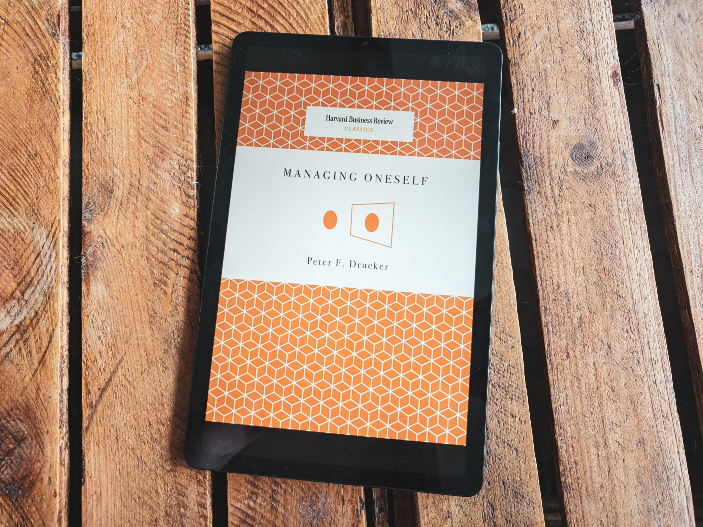

Bardzo krótka i konkretna książka, w której zawarte są meta-informacje o najbardziej podstawowych elementach pracy, które powinienem “ogarnąć”, zanim zacząłem szukać projektów, w których będę najbardziej przydatny i maksymalnie wykorzystam swój potencjał.

Kluczowe lekcje:

- Poznaj swoje mocne strony, sposób działania oraz wartości.
- Na tej podstawie przygotuj się do udanej kariery, zamiast ją planować.
- Poszukaj miejsca, w którym będziesz najbardziej przydatny/przydatna.
- Weź odpowiedzialność za współpracę z innymi.

Dużo wspólnych kropek z [Essentialism](https://www.goodreads.com/book/show/18077875-essentialism).

Wielką pomocą we wdrażaniu opisanych w książce taktyk jest wg mnie [test Gallupa](https://www.gallup.com/cliftonstrengths/en/252137/home.aspx).

**Moja ocena: 8/10**

## Mocne strony

**Znajdź swoje mocne strony**, bo tylko dzięki działaniu w oparciu o nasze mocne strony jesteśmy w stanie dokonać czegoś większego.

Większość osób nie ma jednak pojęcia, jakie są ich mocne i słabe strony.

> Most people think they know what they are good at. They are usually wrong. More often, people know what they are not good at—and even then more people are wrong than right. And yet, a person can perform only from strength. One cannot build performance on weaknesses, let alone on something one cannot do at all.

Jak je znaleźć?

Mocne i słabe strony możemy znaleźć przez wypisanie oczekiwanych rezultatów, gdy podejmujemy jakąś decyzje lub działanie, porównanie tych wyników z oczekiwaniami, zebranie feedbacku i dokonanie analizy.

Taka analiza pokaże, z czym sobie dobrze radzimy, a w czym niekoniecznie.

Pokazuje też, czego nie powinniśmy się podejmować. Jest wiele obszarów, w których nie mamy najmniejszych szans osiągnąć nawet przeciętnych wyników, więc nie ma sensu się nimi zajmować.

Nie próbuj specjalnie poprawiać swoich słabych stron, bo to zużywa bardzo dużo energii. Znacznie lepiej przeznaczyć tę energię na przejście z poziomu "jestem w tym dobry" na poziom "jestem w tym zajebisty".

> One should waste as little effort as possible on improving areas of low competence. It takes far more energy and work to improve from incompetence to mediocrity than it takes to improve from first-rate performance to excellence.

Na podstawie feedbacku i analizy umacniaj swoje mocne strony i uzupełniaj braki.

## Sposób działania

Osiągamy najlepsze wyniki, gdy działamy w zgodzie ze swoim programowaniem.

**Dlatego dowiedz się, w jaki sposób działasz i pracujesz.**

Sposób działania można nieznacznie zmodyfikować, ale szanse na zmianę o 180* są małe i niełatwe.

**Zrozum, w jaki sposób się uczysz.**

> Of all the important pieces of self-knowledge, understanding how you learn is the easiest to acquire.

Pytania, które warto sobie zadać:

**Wolę czytać, czy słuchać?**

**W jaki sposób się uczę?**

- Przez czytanie?
- Pisanie?
- Słuchanie?
- Akcję?
- Mówienie do siebie na głos?

Pisarze często słabo radzą sobie w szkole, bo ich preferowanym sposobem nauki jest pisanie, a nie czytanie i słuchanie. Szkoła nie pozwala im uczyć się w ten sposób, więc dostają słabe oceny.

> Beethoven, for example, left behind an enormous number of sketchbooks, yet he said he never actually looked at them when he composed. Asked why he kept them, he is reported to have replied, “If I don’t write it down immediately, I forget it right away. If I put it into a sketchbook, I never forget it and I never have to look it up again.”

**Czy dostarczam najlepsze wyniki, gdy pracuję w zespole, czy samemu?**

**Jeśli wolę działać z ludźmi, to w jakiej konfiguracji?**

- Jako podwładny?
- Jako członek zespołu?
- Jako mentor?

> Some are exceptionally talented as coaches and mentors; others are simply incompetent as mentors.

**Wolę podejmować decyzje, czy doradzać?**

Niektórzy świetnie radzą sobie jako doradcy, ale nie potrafią podejmować decyzji.

***💡 Note:*** Trochę tak mam i muszę się hackować przez ograniczanie opcji oraz mniejsze eksperymenty, które mnie czegoś nauczą i ułatwią podjęcie decyzji.

Inni potrzebują doradcy, żeby zmusił ich do myślenia i zastanowienia się nad podejmowaną decyzją. Tylko wtedy są w stanie szybko i pewnie podejmować decyzje.

Często z tego powodu, gdy świetni doradcy dostają awans na wyższe stanowisko, które wymaga wcielenia się w osobę decyzyjną, nie umieją sobie poradzić w nowej roli.

Paradoksalnie, dostają awans dlatego, że byli świetnymi doradcami. Bo osoby decyzyjne lubią otaczać się partnerami, którzy umieją doradzać.

**Czy lepiej działam w stresie, czy w mocno ustrukturyzowanym i przewidywalnym środowisku?**

**Czy lepiej działam w dużych organizacjach, czy małych?**

Niewiele osób działa dobrze w jednych i drugich.

> The conclusion bears repeating: Do not try to change yourself—you are unlikely to succeed. But work hard to improve the way you perform. And try not to take on work you cannot perform or will only perform poorly.

Test Gallupa pomaga wielu osobom zrozumieć te wszystkie rzeczy.

## Wartości

Poznaj swoje wartości, żeby zrozumieć, do których miejsc pasujesz.

Gdy nasze wartości (nawet niewypowiedziane) nie są kompatybilne z wartościami organizacji, w której pracujemy, to będziemy się frustrować, niewłaściwie wykonywać nasze zadania, a w końcu przestaniemy dowozić wyniki.

Wartości nie muszą być takie same, ale wystarczająco podobne, żeby ze sobą koegzystować.

**Traktuj swoje wartości jako ostateczny test, który powie Ci, czy powinieneś nad czymś pracować.**

Przeważnie nasze mocne strony i wartości się uzupełniają. Jednak czasem stoją w konflikcie.

W takich sytuacjach nie poświęcaj się pracy, która jest niezgodna z Twoimi wartościami, nawet jeśli możesz wykorzystać w niej swoje mocne strony.

## Przygotuj się do udanej kariery

**Jeśli chcesz mieć udaną karierę i znaleźć miejsce, do którego przynależysz, to przygotuj się do niej, zamiast planować** - poznaj swoje mocne strony, sposób działania oraz wartości.

Udana kariera jest często wynikiem przygotowania i zareagowania na pojawiającą się okazję (okno możliwości), a nie wynikiem planowania.

Gdy już wiemy, na czym się znamy i w jaki sposób pracujemy, to łatwiej jest nam dokonać transformacji z ciężko pracującego, kompetentnego, ale przeciętnego pracownika, w takiego, który się wyróżnia.

Większość osób, zwłaszcza utalentowanych, zaczyna rozumieć, gdzie jest ich miejsce dopiero przed trzydziestką i nie ma w tym nic złego. Dotychczasowy czas powinniśmy jednak poświęcić na poznanie siebie.

## Jak znaleźć miejsce, w którym będziemy najbardziej przydatni?

Żeby znaleźć miejsce, w którym będziemy najbardziej przydatni (inaczej Punkt największej użyteczności, jak to określa Greg McKeown w "Essentialism"), odpowiedz sobie na trzy pytania:

- Czego wymaga sytuacja?
- Gdzie będę najbardziej przydatny, biorąc pod uwagę moje mocne strony, sposób pracy oraz wartości.
- Jakie wyniki muszę osiągnąć, żeby miało to znaczenie?

Najczęściej można do sprowadzić do jednego pytania: **Gdzie i w jaki sposób, w ciągu następnego półtora roku, mogę osiągnąć wyniki, które będą miały znaczenie?**

> it is rarely possible—or even particularly fruitful—to look too far ahead. A plan can usually cover no more than 18 months and still be reasonably clear and specific.

Wyniki, które chcemy osiągnąć, powinny:

- Być trudne do osiągnięcia, jednak w zasięgu ręki (stretch goals).
  - Celowanie w rzeczy, które nie mogą być przez nas osiągnięte, lub nie pozwalają na to okoliczności, to nie ambicja, tylko głupota.
- Mieć znaczenie.
- Być obserwowalne i (jeśli to możliwe) mierzalne.

Te trzy rzeczy tworzą nasz kierunek działania: co robić, gdzie i jak zacząć, jakie są nasze cele i deadline'y.

Przykład:

> The new administrator decided that his contribution should be to establish a standard of excellence in one important area within two years. He chose to focus on the emergency room, which was big, visible, and sloppy. He decided that every patient who came into the ER had to be seen by a qualified nurse within 60 seconds. Within 12 months, the hospital’s emergency room had become a model for all hospitals in the United States, and within another two years, the whole hospital had been transformed.

## Odpowiedzialność za dobrą współpracę z innymi

Jesteśmy odpowiedzialni za dobrą współpracę z innymi.

**Dobra współpraca z innymi budowana jest na podstawie zaufania.** Nie oznacza to, że musimy się lubić ze wszystkimi, wystarczy, że się rozumiemy.

Jeśli chcesz, żeby współpraca przebiegała pomyślnie (i [bez dysfunkcji](https://www.goodreads.com/book/show/21343.The_Five_Dysfunctions_of_a_Team)) to:

- Zaakceptuj fakt, że każdy działa inaczej.
- Poznaj mocne strony, sposób działania oraz wartości osób, z którymi pracujesz.
  - Wszystkie te rzeczy możesz potem wykorzystać.
  - Jest to szczególnie ważne, jeśli w swojej pracy musisz polegać na innych.
- Jeśli oczekujesz dobrej współpracy ze swoim szefem, to zrozum, w jaki sposób pracuje i dopasuj swój sposób pracy do tego, żeby mógł wykonywać swoją pracę jak najlepiej i dowozić wyniki. To jest "sekret zarządzania swoim szefem".
- Weź odpowiedzialność za komunikację.
  - W każdej chwili możemy oznajmić: "W tym jestem dobry, tak pracuję, to są moje wartości, to jest mój wkład, oczekuję dowieźć takie a takie wyniki."
  - W każdej chwili możemy zapytać: "Co muszę o Tobie wiedzieć? Jakie są Twoje mocne strony, sposób pracy i wartości? Czego mogę po Tobie oczekiwać?"
  - Powinniśmy oczekiwać tych informacji od wszystkich osób, z którymi pracujemy, niezależnie od tego, czy jest to członek zespołu, kolega, kierownik, czy ktokolwiek inny.
