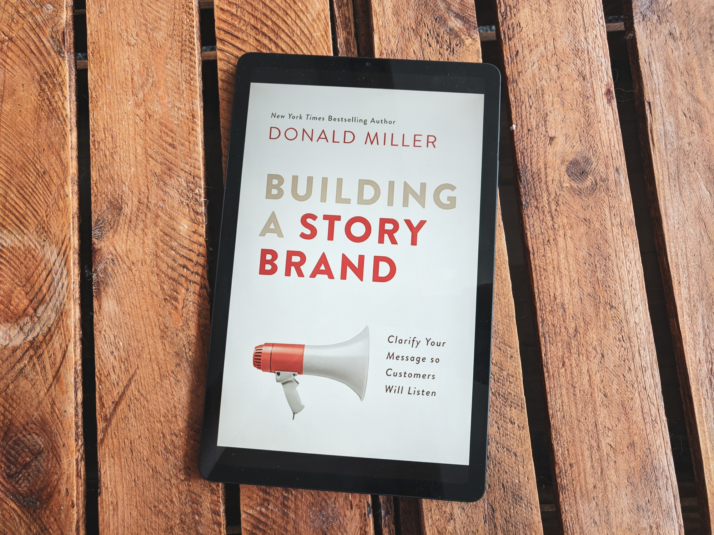
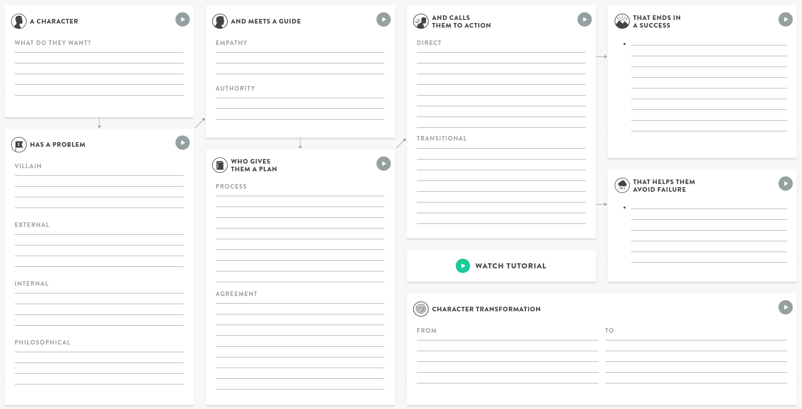

Książka opisuje framework StoryBrand, który pozwala przedstawić potencjalnemu klientowi swoje produkty lub usługi, korzystając ze sprawdzonego formatu opowieści (głównie filmowych).

Głównym problemem książki jest spora ilość powtórzeń, które niczego nie wnoszą i wprowadzają chaos, a także przykłady implementacji, które zahaczają o takie cliché jak "pokaż, dokąd zabierzesz swojego klienta przez pokazaniu mu zdjęć szczęśliwych ludzi korzystających z twojego produktu".

Po odfiltrowaniu tego wszystkiego dostajemy solidny framework, który ułatwia wyrażenie w prosty sposób, w czym możemy pomóc osobom, które zechcą z nami współpracować.

**Moja ocena: 4/6**

**Framework opowieści:**

- Bohater
- ma problem
- i spotyka przewodnika,
- który daje mu plan
- i zachęca ich do podjęcia akcji,
- pomaga uniknąć porażki
- i osiągnąć to, czego pragnie.

**Przekłada się to na 7 zasad:**

- Zasada 1: Klient jest bohaterem
- Zasada 2: Klient kupuje rozwiązanie wewnętrznych problemów
- Zasada 3: Klient szuka przewodnika
- Zasada 4: Klient ufa przewodnikowi, który ma plan
- Zasada 5: Klient nie podejmie akcji, dopóki go do tego nie zaprosimy
- Zasada 6: Klient chce uniknąć porażki
- Zasada 7: Nie zakładaj, że klient rozumie, że możesz zmienić jego życie, powiedz mu to wprost

## Zasada 1: Klient jest bohaterem

**Podsumowanie:**

- **To klient jest bohaterem**, a nie Twój biznes. Jednym z największych błędów jest stawianie swojego biznesu, jako bohatera opowieści.
  - Pamiętaj, że jesteś dla niego tym, kim Yoda jest dla Luke'a.
- Pierwszy krok polega na określeniu, kim jest klient, zidentyfikowaniu, czego chce i stworzeniu luki w opowieści przez wskazanie mu kierunku, w którym chcemy go zabrać.
- Spisz potencjalne pragnienia Twojego klienta, które możesz zaspokoić.
  - Odpowiedz na pytanie "Czego pragnie mój klient?"
- Zdecyduj się na jedną z tych rzeczy w formie jednego zdania. Przykłady:
  - Financial Advisor: “A Plan for Your Retirement”
  - College Alumni Association: “Leave a Meaningful Legacy”
  - Fine-Dining Restaurant: “A Meal Everybody Will Remember”
  - Real Estate Agent: “The Home You’ve Dreamed About”
  - Bookstore: “A Story to Get Lost In"
  - Breakfast Bars: "A Healthy Start to Your Day"
- Tworzysz w taki sposób lukę w opowieści, która stawia przed klientem pytanie - czy uda Ci się zaspokoić to, czego on chce?

### Stwórz lukę w opowieści:

Przykład: Jason Borne stracił pamięć, czy uda mu się znaleźć kogoś, kto mu pomoże?

Dlaczego luka jest taka istotna? Bo mózg zrobi wszystko, żeby ją domknąć.

Spróbuj zaśpiewać jakąś piosenkę w głowie i przerwij w połowie zdania. Niedokończony fragment będzie Cię męczyć jeszcze przez długi czas.

Gdy nie uda nam się zdefiniować, czego chce nasz klient, to nie uda nam się otworzyć luki w opowieści. Bez tego, nie ma on motywacji do działania, ponieważ nie ma
żadnego pytania, które wymaga odpowiedzi.

Zdefiniowanie czego chce klient i umieszczenie tego w materiałach marketingowych tworzy lukę w opowieści. Klient będzie chciał wiedzieć, w jaki sposób zamierzasz ją domknąć.

### Zredukuj pragnienie klienta do jednej rzeczy.

Jednym z większych błędów jest próba zaspokojenia wielu pragnień naraz.

Skup się najpierw na zaspokojeniu jednego pragnienia, z którym pomaga Twój biznes i dopiero potem definiuj (nadal pojedyncze) pragnienia dla podproduktów i pozostałych elementów Twojego biznesu.

### Wybierz pragnienie, które jest związane z potrzebą przetrwania.

> Instead of saying, “Inhale knowledge, exhale success,” simply say, “Helping you become everyone’s favorite leader.”

Czym jest przetrwanie? Bezpieczeństwo, zdrowie, szczęście, siła.

- Dobre zagospodarowanie pieniędzmi.
- Dobre zagospodarowanie czasem.
- Budowa sieci kontaktów.
- Uzyskanie statusu.
- Gromadzenie zasobów.
- Wewnętrzna potrzeba bycia hojnym.
- Pragnienie, żeby życie miało znaczenie i sens.

### Zdefiniuj konkretnie, w którym kierunku chcesz zabrać swojego klienta.

Maksymalnie uprość przekaz i oprzyj go na konkretach.

## Zasada 2: Klient kupuje rozwiązanie wewnętrznych problemów

**Podsumowanie:**

- Każda dobra opowieść potrzebuje złoczyńcy.
  - Złoczyńca jest źródłem trzech rodzajów problemów: zewnętrznych, wewnętrznych i filozoficznych.
- Spisz potencjalnych złoczyńców.
- Spisz zewnętrzne problemy.
  - Czy jest wśród nich taki, który reprezentuje największą część twoich produktów i tego, co oferujesz?
- Spisz wewnętrzne problemy (frustracje i wątpliwości).
  - Czy jest wśród nich jeden, który odzwierciedla uniwersalny problem lub doświadczenia Twoich klientów?
- Spisz filozoficzne problemy.
  - Czy Twój biznes jest częścią jakiejś większej opowieści?
  - Czy jest coś na poziomie filozoficznym, przeciwko czemu opowiada się Twój biznes?
- Wybierz po jednym.

### Zacznij mówić o problemach klienta.

Jeśli dobrze je zdefiniujesz, to będzie on wiedzieć, że go rozumiesz i zwiększysz jego zainteresowanie.

Problemy to "hook" każdej opowieści.

**W jaki sposób rozmawiać o problemach klienta?**

Każda opowieść potrzebuje złoczyńcy. Nasz produkt to broń lub sposób, którym można pokonać tego złoczyńcę.

Złoczyńca nie musi być osobą, ale warto dokonać personifikacji.

**Przykład:** gdy sprzedajesz soft do monitorowania czasu spędzanego nad zadaniem, to złoczyńcą są "złośliwe rozpraszacze".

Cechy dobrego złoczyńcy:

- **Złoczyńca musi być przyczyną.** Frustracja to skutek, a nie przyczyna. Przyczyną są np. wysokie - podatki.
- **Złoczyńca musi być nam bliski.** Musimy od razu rozpoznać, że to coś lub ktoś, kim gardzimy.
- **Złoczyńca musi być jeden.** Więcej niż jeden zbytnio rozcieńczy przekaz.
- **Złoczyńca musi być prawdziwy.** Nie możemy straszyć ludzi i wymyślać "potencjalnych" złoczyńców, którzy im grożą. Ludzie mają wystarczająco dużo prawdziwych złoczyńców/problemów w swoim życiu.

Złoczyńca, to główne źródło konfliktu, z którym radzi sobie Twój produkt lub usługa.

### Złoczyńca jest powodem konfliktu, który toczy się na trzech poziomach.

Są trzy rodzaje problemów klienta (i ludzi ogólnie):

- Zewnętrzny
- Wewnętrzny
- Filozoficzny

Dobry biznes rozwiązuje wszystkie trzy.

**W dobrej opowieści złoczyńca tworzy *zewnętrzny problem*, który powoduje, że bohater odczuwa *wewnętrzną frustrację*, która jest zła na poziomie *filozoficznym*.**

**Zewnętrzny problem jest najcześciej czymś fizycznym** - cieknąca rura, głód. Jego celem jest ujawnienie wewnętrznego problemu.

**Wewnętrzny problem to głębsza frustracja i wątpliwości bohatera** - poczucie, że jest się gorszym ("do I have what it takes?"), zagubionym, lub po prostu nieszczęśliwym.

Wewnętrzna potrzeba wyeliminowania frustracji jest ważniejsza niż potrzeba wyeliminowania zewnętrznego problemu.

**Jedynym powodem, dla którego klienci kupują, jest potrzeba rozwiązania wewnętrznego problemu.**

Jeśli uda się nam go zidentyfikować i wyeliminować, a do tego pozbyć się jeszcze zewnętrznego problemu, to jesteśmy w domu.

W taki sposób wartość naszego produktu się zwiększa.

**Problemy filozoficzne są czymś większym niż sama opowieść.** Problem filozoficzny to pytanie "dlaczego?" i ma głębsze znaczenie. Dlaczego jest to ważne dla wszystkich ludzi?

Najlepiej mówić o problemach filozoficznych w kontekście **"powinno/nie powinno":**

- "Źli ludzie nie powinni wygrywać".
- "Wszyscy powinni być traktowani uczciwie".

> People want to be involved in a story that is larger than themselves.
> - everybody deserved to work for a great manager
> - “Pets deserve to eat healthy food too.”
> - “Because this summer should be remembered forever.”
> - “No music, no life.”

### Wypozycjonuj swój produkt jako narzędzie, które rozwiązuje wszystkie 3 rodzaje problemów i które może być użyte do walki, żeby ustawić rzeczy w taki sposób, jak powinny lub nie powinny działać.

> Storytellers use this formula to endear audiences all the time. When Luke shoots the photon torpedo through the little hole in the Death Star, he actually resolves the external problem of destroying the Death Star, the internal problem that had him wondering whether he had what it took to be a Jedi, and the philosophical problem of good versus evil, all with the press of a button.

> TESLA MOTOR CARS:
> - Villain: Gas guzzling, inferior technology
> - External: I need a car.
> - Internal: I want to be an early adopter of new technology.
> - Philosophical: My choice of car ought to help save the environment.

> EDWARD JONES FINANCIAL PLANNING:
> - Villain: Financial firms that don’t listen to their customers
> - External: I need investment help.
> - Internal: I’m confused about how to do this (especially with all the tech-driven resources out > there).
> - Philosophical: If I’m going to invest my money, I deserve an advisor who will thoughtfully explain > things in person.

Pamiętaj, żeby mieć tylko jednego złoczyńcę i po jednym problemie każdego rodzaju.

## Zasada 3: Klient szuka przewodnika

**Podsumowanie:**

- Klient szuka przewodnika, komu może zaufać, a to wymaga od biznesu empatii i wykazania się autorytetem.
- Uzupełnij swój przekaz o empatię.
- Znajdź sposób na zademonstrowanie autorytetu.

### Klient (tak jak bohater) szuka przewodnika, bo jeśli potrafiłby rozwiązać swoje problemy samemu, to by go tu nie było i nie byłoby żadnej opowieści.

Nie stawiaj się w pozycji bohatera. Nie mów, jaki jesteś zajebisty, bo stawiasz się w pozycji przeciwnika, zamiast przewodnika.

> Jay Z failed to answer the one question lingering in the subconscious of every hero customer: How are you helping me win the day? Tidal existed to help the artists win the day, not customers. And so it failed.

Przejmuj się sukcesem swoich klientów, a nie swoim.

Bohater nigdy nie wie, czy mu się uda. Wątpi w siebie. Przewodnik już był w tym miejscu, pokonał przeciwności i teraz ma autorytet, żeby przekazać informacje dalej - "been there, done that".

** Dwie rzeczy charakteryzujące dobrego przewodnika:**

- Empatia
- Autorytet

### Wyrażaj empatię

Pokaż, że można Ci zaufać.

Pokaż, że rozumiesz problemy klienta na wszystkich poziomach.

Używaj zdań typu "wiem, jak to jest...", "byłem tak samo sfrustrowany..."

Dobrze zdefiniowane problemy powodują, że łatwo napisać taki przekaz.

Pokaż klientom, że jesteś taki, jak oni. Że jesteś jednym z nich.

**💡 Note:** W książce nie ma dobrych przykładów jak to robić. Według mnie, powinniśmy budować prawdziwą i transparentną relację opartą o zaufanie tak, jak jest to opisane w [Company of One](/company-of-one/).

### Pokaż swój autorytet i kompetencje.

Nie przechwalaj się, ale pokaż, że wiesz, o co chodzi.

Klient ufa ludziom, którzy wiedzą, co robią.

Kilka sposobów na zademonstrowanie swoich kompetencji:

- Testimonials (nie więcej niż 20, żeby nie zrobić z siebie bohatera)
- Statystyki
- Nagrody
- Loga

**💡 Note:** Tutaj znowu, znacznie lepiej jest zajrzeć do Company of One i wykorzystać naukę, jako kanał marketingowy:

> "Out-teach and outshare the competition, not outscale them"

## Zasada 4: Klient ufa przewodnikowi, który ma plan

**Podsumowanie:**

- Spisz proste kroki, które musi wykonać klient, żeby zawrzeć z Tobą umowę.
  - Plan przed- i pozakupowy lub mieszanka obydwu.
- Jakie są potencjalne obawy i wątpliwości związane z Twoją branżą i niszą?
  - Jaki układ możesz zaproponować swoim klientom, żeby pozbyć się tych obaw?
  - Niech Twój plan ma tytuł.
- Czy są jakieś unikalne wartości, które dzielisz z Twoimi klientami? Czy możesz zamieścić je w swoim planie?
- Spisz swój plan.

**💡 Note:** Najbardziej mętny i niepotrzebnie rozdmuchany rozdział w książce. W skrócie chodzi o to, żeby stworzyć krótki plan (maksymalnie 6 kroków), który pokaże proces, przez który chcemy przeprowadzić klienta. Przykładowo:

Kup -> Opłać -> Ciesz się dostępem przez cały rok -> Zrezygnuj w każdej chwili logując się do panelu

Klient szuka prostej ścieżki, dzięki której uniknie pomyłek.

Dobra relacja nie wystarczy, żeby domknąć sprzedaż.

W momencie podjęcia decyzji klient myśli "a co jeśli się nie uda?", "czy to dobra inwestycja?" Dobry plan odpowiada na te pytania.

Dobry plan wyjaśnia jak będzie wyglądała współpraca i/lub rozwiewa poczucie ryzyka związanego z zakupem.

**Dwa rodzaje planów:**

- **Process Plan**
  - Eliminuje niejasności.
  - Opisuje co dzieje się przed i po zawarciu umowy.
  - Pokazuje jak dokonać procesu zakupu.
  - Każdy plan powinien mieć maks 6 kroków. Jeśli Twój produkt wymaga więcej, to znaczy, że coś z nim nie tak.
- **Agreement Plan**
  - Eliminuje strach.
  - Jest to coś w rodzaju FAQ.
  - Nie musi być bardzo widoczne, ale musi odpowiadać na wątpliwości klienta.

**Nazwij swój plan.**

Chodzi o to, żeby zwiększyć postrzeganą wartość produktu.

**Process plan:**

- "Easy installation plan"
- "World's best night's sleep plan"

**Agreement plan:**

- "Customer satisfaction agreement"
- "Our quality guarantee"

## Zasada 5: Klient nie podejmie akcji, dopóki go do tego nie zaprosimy

**Podsumowanie:**

- Klient potrzebuje, żeby wezwać go do podjęcia akcji. Sugerowane są dwa sposoby:
  - Wezwanie bezpośrednie - wielki czerwony przycisk "Kup teraz", "Zapisz się"
  - Wezwanie pośrednie - PDF, webinar, kurs mailowy itd.
- Zdecyduj, jakie jest Twoje bezpośrednie wezwanie do akcji.
- Wybierz przejściowe wezwanie do akcji, które pozwoli Ci uznać jakieś terytorium za swoje, pozwoli, żeby zadziałała reguła wzajemności i ustawi Cię w pozycji przewodnika.

W opowieściach bohater jest wzywany do podjęcia akcji i nie podejmuje ich sam od siebie.

> Liam Neeson’s character wouldn’t have chased the bad guys to Europe unless his daughter had been kidnapped.

Używaj dwóch rodzajów wezwania do działania:

- **Bezpośrednie**, które zachęca wprost do zakupu.
- **Przejściowe**, które pogłębia Waszą relację.

> To further the relational metaphor, a transitional call to action is like saying, “Can I take you out on a date?” to your customer, and a direct call to action is like saying, “Will you marry me?”

### Spraw, żeby klient wiedział, czego konkretnie od niego oczekujesz.

> Companies that don’t make their calls to action clear remind me of my dating days before I met my wife. Instead of clearly asking a girl out, I’d say something like, “Coffee is nice, isn’t it? Do you like coffee?”

Najlepszy sposób na rozwinięcie biznesu jest stworzenie jasnego wezwania do działania i powtarzanie go w kółko.

Stwórz przycisk, który jest wezwaniem do działania i umieść go above the fold.

To powinien być najbardziej wyróżniający (ale niekoniecznie jedyny) przycisk na stronie. Umieść go też na dole strony.

Przykłady:

- Kup teraz.
- Zapisz się.
- Umów się na spotkanie.

Bezpośrednie wezwanie do działania możesz umieścić też w stopce maila, na bannerach itp.

**Nie próbuj sprzedawać pasywnie, bo to może sygnalizować brak wiary w swój własny produkt.**

Sprzedawanie pasywne, bez jasnego wezwania, to jak proszenie o zapomogę.

Klienci nie szukają biznesów, które potrzebują zapomogi.

**Przejściowe wezwanie do działania robi dla Ciebie trzy rzeczy:**

- **Jest oświadczeniem, że zajmujesz terytorium.** Blog, PDF, mailing, czy krótki kurs pozycjonują Cię jako eksperta i autorytet w danym temacie.
- **Jest zgodnie z regułą wzajemności.** Im więcej informacji będziesz oddawać za darmo, tym większa szansa, że będą mogli dać Ci coś w zamian w przyszłości. Nigdy nie obawiaj się dzielić wszystkim, czym tylko możesz.
- **Pozycjonuje Cię jako przewodnika, za każdym razem, gdy rozwiążesz czyjś problem.** Gdy następnym razem ktoś natknie się na problem w podobnym obszarze, to przyjdzie do Ciebie po pomoc.

**Przykłady przejściowego wezwania do działania:**

- Darmowa informacja (video, podcasty, webinary, live'y).
- Testimonialsy.
- Próbki.
- Darmowy trial.

> As one of our StoryBrand Certified Guides consulted with the clinic, she told the owner to remove the television and magazines. Instead of magazines, she encouraged them to create a transitional call to action called “The Healthy Body Checklist,” allowing patients to self-assess their health.

## Zasada 6: Klient chce uniknąć porażki

**Podsumowanie:**

- Spisz przynajmniej 3 negatywne konsekwencje, których pomagasz uniknąć swoim klientom.

W opowieściach bohater ma dwie motywacje: **chce uciec od czegoś złego albo doświadczyć czegoś dobrego**. Jak w życiu. Chęć uniknięcia cierpienia powoduje, że zaczynamy szukać rozwiązania naszych problemów.

> We sat on the edge of our seats in Jaws because we knew the citizens of Amity Island might be killed by the shark if Chief Martin Brody didn’t do something.

**Pokaż klientowi w jasny sposób, co straci, nie współpracując z Tobą.**

Pokaż mu koszt niepodjęcia współpracy.

Jakich konsekwencji pomagasz mu uniknąć?

Czy mogą stracić pieniądze lub coś innego, co dla niego ważne?

Gdy klient nie ma czego stracić, to nie będzie przejmował się Twoją ofertą.

Używaj tego punktu ostrożnie. Nie każdy przekaz musi z niego korzystać.

Niekoniecznie musi to być porażka, ale stawka w grze musi być wysoka.

**Odpowiedz na niewypowiedziane pytanie każdego klienta: "i co z tego?"**

Może to być w formie blog posta, maila, bulletpointów na stronie.

Klient najzwyczajniej w świecie może nie wiedzieć co traci, albo na co się naraża i warto mu to pokazać dla jego własnego dobra. W taki sposób dowie się dlaczego jest to ważne.

To wszystko działa dlatego, że jesteśmy bardziej motywowani przez niechęć do straty, o czym mówi Teoria Perspektywy:

- Znacznie bardziej przejmowalibyśmy się utratą niż wygraniem 100 złotych.
- Teoretycznie, niechęć doświadczenia straty motywuje nas 2-3x bardziej niż potencjalny zysk.

> When receivers are either very fearful or very unafraid, little attitude or behavior change results. High levels of fear are so strong that individuals block them out; low levels are too weak to produce the desired effect. Messages containing moderate amounts of fear-rousing content are most effective in producing attitudinal and/or behavior change.

**💡 Note:** Taktyki opisane w tym rozdziale bardzo łatwo można zamienić w manipulację i sama książka trochę to sugeruje, wspominając zastosowanie szczypty strachu w przekazie marketingowym. Transparentna wersja tego, co to jest opisane, polega najprawdopodobniej na tym, żeby pokazać rzeczy, o których klient może nie wiedzieć. Ludzie czasem nie wiedza, co jest możliwe, że coś tracą albo że na coś się narażają.

Wyjątkowo gówniany przykład:

“Don’t postpone your retirement. You’ve worked too hard for too long to not enjoy time with your grandchildren.”

## Zasada 7: Nie zakładaj, że klient rozumie, że możesz zmienić jego życie, powiedz mu to wprost

**Podsumowanie:**

- Spisz udane zakończenia, które pomagasz osiągnąć swoim klientom.
- Jak będzie wyglądać ich życie po tym, jak użyją Twoich produktów lub usług?

**Szczęśliwe zakończenie to najważniejszy element frameworka StoryBrand.**

Jak wszystko wcześniej, zakończenie musi być jasno określone, nie może być rozmyte.

**Pokaż klientowi, jak będzie wyglądało jego życie, gdy podejmie z Tobą współpracę.**

Zaoferuj mu wizję przyszłości. Dokąd chcesz ich zabrać?

Zapewniasz bezpieczeństwo? Fun? Sławę?

> Successful brands, like successful leaders, make it clear what life will look like if somebody engages their products or services. Nike promised to bring inspiration and innovation to every athlete. Likewise, Starbucks offered to inspire and nurture their customers, one cup at a time. For years, Men’s Wearhouse promised, “You’ll like the way you look,” and they even guaranteed it.

Przydatna pomoc - tabelka z książki "Digital Marketer":

- Dwie kolumny - "before" and "after your brand"
- Pytania:
  - What do they have?
  - What are they feeling?
  - What's an average day looks like?
  - What is their status?
- Po wypełnieniu tabelki uprość ten przekaz i umieść w treściach marketingowych.

Możesz też wykorzystać do tego celu obrazki, które pokazują, jak będzie wyglądać życie klienta po zmianach. Ważne, żeby to nie były banały w postaci uśmiechniętych ludzi korzystających z Twojego produktu, jak to sugeruje książka.

### Domknij wcześniej otwartą pętlę opowieści.

Ludzie szukają rozwiązania swoich zewnętrznych, wewnętrznych i filozoficznych problemów. Mogą to osiągnąć przez zdobycie statusu, samorealizację, samoakceptacje lub doświadczenie czegoś wykraczającego poza zasięg ludzkiego poznania.

Powinno być to głównym celem naszych produktów.

Opisz, jak będzie wyglądało życie klienta po rozwiązaniu zewnętrznych, wewnętrznych i filozoficznych problemów, które wcześniej miał.

Domknięcie powinno być proste. Tak jak wspomniany wyżej obrazek.

**Trzy najczęstsze i najpotężniejsze zakończenia polegają na tym, że bohater:**

- **Zdobywa jakąś pozycję lub władzę (status).**
  - Zaoferuj ekskluzywny dostęp do czegoś.
  - Wykorzystaj niedobór (scarcity) - gdy czegoś jest mało, to tym bardziej tego chcemy.
  - Zaoferuj coś premium, specjalne przywileje.
  - Zaoferuj lepszą tożsamość (jak Apple).
- **Jednoczy się z kimś lub z czymś, co go dopełnia (kompletność).**
  - Wyeliminowanie obaw (poczucie domknięcia, satysfakcja z dobrze zrobionej roboty).
  - Mniej pracy dzięki jakiemuś narzędziu np. aplikacji.
  - Więcej czasu (system, filozofia, usługa).
- **Doświadcza samorealizacji, która go dopełnia (osiągnięcie swojego potencjału lub akceptacja siebie).**
  - Osiągnięcie czegoś, co zawsze nas inspirowało.
  - Akceptacja samego siebie.
  - Uczestniczenie w czymś większym od nas.

Zaoferuj coś, co pomoże zaspokoić jedną z tych potrzeb, ponieważ są to trzy dominujące potrzeby człowieka.

## Klienci chcą, żebyś uczestniczył w ich transformacji.

**Podsumowanie:**
- Spisz, jakiej przemiany osobowości chce dokonać Twój klient.
  - Kim chce zostać?
  - Jak chce być postrzegany przez innych?
- Zapisz to w formie od-do.
  - Przykład: Od zagubionego, do kompetentnego i świadomego

Każdy człowiek, bohater opowieści i klient chce doświadczyć transformacji.

Biznes, który uczestniczy w transformacji osobowości swoich klientów, tworzy zagorzałych orędowników swoich produktów i usług. To dlatego, że w taki sposób pomagasz zmienić im swoje życie.

Zadaj sobie pytania:

- Kim chce zostać nasz klient?
- Jaką chce być osobą?
- W jaki sposób pragnie zmienić swoją osobowość?
- W jaki sposób chciałby, żeby postrzegali go znajomi?

Pokaż, kim zostanie osoba, która nawiąże z Tobą współpracę.

Gdy już poznasz, jaką osobą chce być Twój klient, to wykorzystuj to w swoich kanałach komunikacji.

**Przykład:**

> “Welcome back to The Dave Ramsey Show, where debt is dumb, cash is king, and the paid-off home mortgage has taken the place of the BMW as the status symbol of choice.”
>
> There they are, the elements of story, complete with an identity to step into and a new status symbol to go along with it.
>
> Dave’s understanding of his listeners’ external problems (consumer debt and financial illiteracy), internal problems (confusion and a feeling of hopelessness), as well as their philosophical problem (accruing debt for things we don’t need posits moral questions) engages listeners in a living story.

